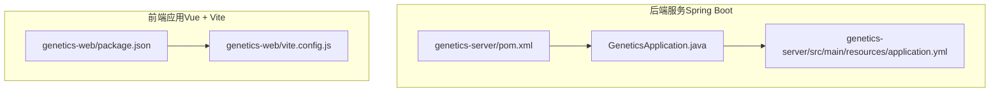
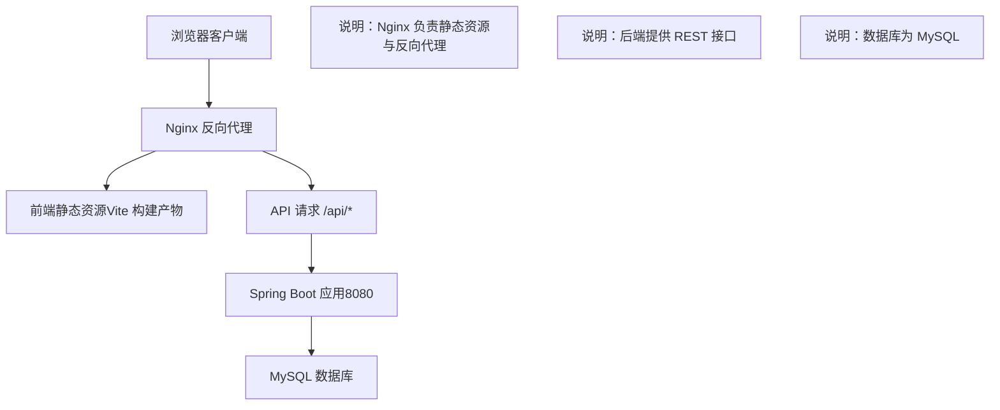
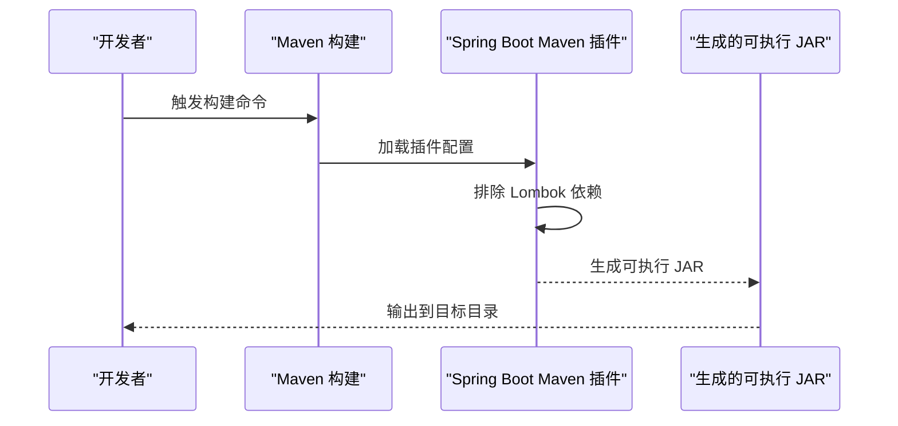
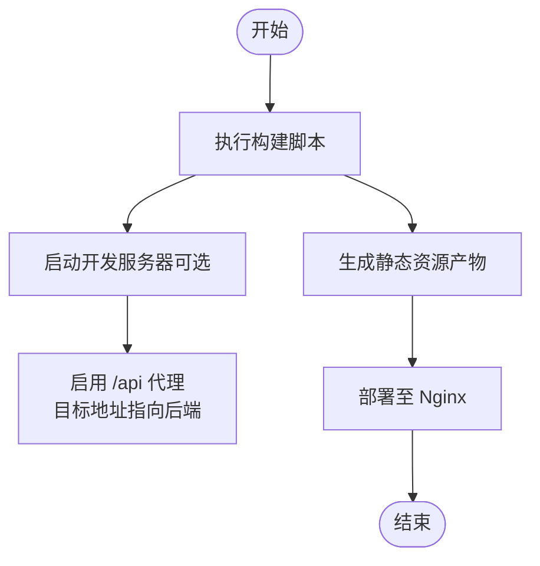
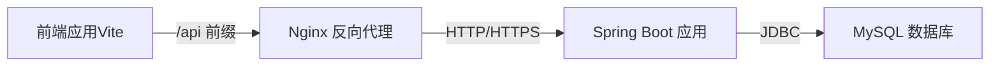

# 应用部署

<cite>
**本文引用的文件**
- [pom.xml](file://genetics-server/pom.xml)
- [application.yml](file://genetics-server/src/main/resources/application.yml)
- [GeneticsApplication.java](file://genetics-server/src/main/java/com/genetics/GeneticsApplication.java)
- [package.json](file://genetics-web/package.json)
- [vite.config.js](file://genetics-web/vite.config.js)
</cite>

## 目录
1. [简介](#简介)
2. [项目结构](#项目结构)
3. [核心组件](#核心组件)
4. [架构总览](#架构总览)
5. [详细组件分析](#详细组件分析)
6. [依赖关系分析](#依赖关系分析)
7. [性能考虑](#性能考虑)
8. [故障排查指南](#故障排查指南)
9. [结论](#结论)
10. [附录](#附录)

## 简介
本指南面向部署团队与运维工程师，提供一套完整的应用部署方案，覆盖后端 Spring Boot 服务与前端 Vue 应用的打包、构建、容器化与反向代理部署。内容包括：
- 后端 Maven 构建与 JAR 包生成
- application.yml 的环境变量与敏感信息管理建议
- 前端 Vite 构建与静态资源处理
- Nginx 反向代理配置（前后端分离）
- Docker 容器化与 docker-compose 编排
- 负载均衡、SSL 证书与域名绑定
- 部署后的健康检查与监控

## 项目结构
该项目由两个子模块组成：
- 后端服务：基于 Spring Boot 的 Java 应用，使用 Maven 管理依赖与构建
- 前端应用：基于 Vue 3 + Vite 的单页应用（SPA）

**图表来源**
- [pom.xml:1-85](file://genetics-server/pom.xml#L1-L85)
- [application.yml:1-32](file://genetics-server/src/main/resources/application.yml#L1-L32)
- [GeneticsApplication.java:1-13](file://genetics-server/src/main/java/com/genetics/GeneticsApplication.java#L1-L13)
- [package.json:1-24](file://genetics-web/package.json#L1-L24)
- [vite.config.js:1-22](file://genetics-web/vite.config.js#L1-L22)

**章节来源**
- [pom.xml:1-85](file://genetics-server/pom.xml#L1-L85)
- [application.yml:1-32](file://genetics-server/src/main/resources/application.yml#L1-L32)
- [GeneticsApplication.java:1-13](file://genetics-server/src/main/java/com/genetics/GeneticsApplication.java#L1-L13)
- [package.json:1-24](file://genetics-web/package.json#L1-L24)
- [vite.config.js:1-22](file://genetics-web/vite.config.js#L1-L22)

## 核心组件
- 后端 Spring Boot 应用
  - 使用 Spring Boot Maven 插件进行打包，排除 Lombok 以减小运行时体积
  - 默认监听端口与上下文路径在配置文件中定义
  - 数据源连接 MySQL，MyBatis-Plus 提供 ORM 能力
- 前端 Vue 应用
  - 使用 Vite 进行开发与生产构建
  - 开发服务器默认端口与 API 代理指向后端服务
  - 生产构建输出静态资源，由 Nginx 提供服务

**章节来源**
- [pom.xml:68-83](file://genetics-server/pom.xml#L68-L83)
- [application.yml:1-32](file://genetics-server/src/main/resources/application.yml#L1-L32)
- [package.json:1-24](file://genetics-web/package.json#L1-L24)
- [vite.config.js:1-22](file://genetics-web/vite.config.js#L1-L22)

## 架构总览
下图展示部署阶段的关键交互：前端构建产物交由 Nginx 提供静态资源；Nginx 将 API 请求转发至后端服务；后端通过数据源访问数据库。

[此图为概念性架构示意，不直接映射具体源码文件，故无“图表来源”]

## 详细组件分析

### 后端应用：Spring Boot 打包与构建
- Maven 构建流程
  - 使用 Spring Boot Maven 插件生成可执行 JAR 包
  - 构建插件配置排除 Lombok，避免运行时依赖
- 运行入口
  - 主类标注 @SpringBootApplication 并扫描 Mapper 包
- 数据库与日志
  - application.yml 中定义数据源 URL、用户名、密码与驱动
  - Jackson 时间格式与时区、MyBatis-Plus 映射规则与逻辑删除字段
  - 日志级别对业务包开启调试输出

**图表来源**
- [pom.xml:68-83](file://genetics-server/pom.xml#L68-L83)
- [GeneticsApplication.java:1-13](file://genetics-server/src/main/java/com/genetics/GeneticsApplication.java#L1-L13)

**章节来源**
- [pom.xml:68-83](file://genetics-server/pom.xml#L68-L83)
- [GeneticsApplication.java:1-13](file://genetics-server/src/main/java/com/genetics/GeneticsApplication.java#L1-L13)
- [application.yml:1-32](file://genetics-server/src/main/resources/application.yml#L1-L32)

### 后端配置：application.yml 环境变量与敏感信息管理
- 端口与上下文路径
  - server.port、server.servlet.context-path
- 数据库连接
  - spring.datasource.url、username、password、driver-class-name
- JSON 序列化
  - spring.jackson.date-format、time-zone、default-property-inclusion
- MyBatis-Plus
  - map-underscore-to-camel-case、日志实现、逻辑删除字段、Mapper XML 路径
- 日志级别
  - com.genetics 包的日志级别

建议：
- 将敏感信息（如数据库密码）迁移到环境变量或外部配置中心，避免硬编码
- 在 CI/CD 中使用密文管理工具注入敏感值
- 不将 application.yml 提交至版本控制

**章节来源**
- [application.yml:1-32](file://genetics-server/src/main/resources/application.yml#L1-L32)

### 前端应用：Vite 构建与代理配置
- 构建脚本
  - scripts.dev/build/preview 指向 Vite
- 依赖与开发工具
  - Vue 3、Vue Router、Pinia、Axios、Element Plus 等
  - Vite 与 @vitejs/plugin-vue
- 本地开发代理
  - server.proxy 将 /api 前缀请求代理到后端服务地址
  - changeOrigin 用于解决跨域问题

**图表来源**
- [package.json:1-24](file://genetics-web/package.json#L1-L24)
- [vite.config.js:1-22](file://genetics-web/vite.config.js#L1-L22)

**章节来源**
- [package.json:1-24](file://genetics-web/package.json#L1-L24)
- [vite.config.js:1-22](file://genetics-web/vite.config.js#L1-L22)

### Nginx 反向代理配置（前后端分离）
- 静态资源服务
  - 将前端构建产物目录映射为静态站点根目录
- API 反向代理
  - 将 /api 前缀转发至后端服务地址（例如 http://localhost:8080）
  - 设置必要的头部与超时参数，确保代理稳定
- SSL 与域名
  - 配置 HTTPS 证书与域名绑定
  - 可选启用 HTTP/2 与缓存策略
- 负载均衡
  - 多实例后端时，使用 upstream 指定多个后端节点
  - 结合 keepalive 与健康检查提升稳定性

[本节为通用部署实践说明，未直接分析具体源码文件，故无“章节来源”]

### Docker 容器化与编排
- 后端镜像
  - 基于官方 JDK 镜像，复制并运行生成的可执行 JAR
  - 暴露应用端口，挂载外部配置（如 application.yml）或通过环境变量注入
- 前端镜像
  - 基于 Nginx 镜像，复制构建产物到 Nginx 根目录
  - 配置 Nginx 将 /api 代理到后端服务
- docker-compose
  - 定义后端、数据库、Nginx 服务
  - 使用网络隔离与持久化卷
  - 通过环境变量传递数据库连接信息

[本节为通用容器化实践说明，未直接分析具体源码文件，故无“章节来源”]

### 部署后健康检查与监控
- 健康检查
  - 后端：暴露 Actuator 或自定义健康端点，定期探测
  - 前端：Nginx 返回 200 即视为可用
- 监控
  - 收集应用日志、指标与链路追踪
  - 数据库连接池与慢查询监控
  - Nginx 访问日志与错误统计

[本节为通用运维实践说明，未直接分析具体源码文件，故无“章节来源”]

## 依赖关系分析
后端与前端的依赖关系主要体现在运行时交互上：前端通过 /api 前缀调用后端接口，Nginx 作为统一入口协调静态资源与 API 转发。

[此图为概念性依赖示意，不直接映射具体源码文件，故无“图表来源”]

**章节来源**
- [vite.config.js:14-19](file://genetics-web/vite.config.js#L14-L19)
- [application.yml:7-11](file://genetics-server/src/main/resources/application.yml#L7-L11)

## 性能考虑
- 前端
  - 合理拆分代码块与懒加载路由，减少首屏体积
  - 启用 Gzip/Brotli 压缩与 CDN 分发
- 后端
  - 合理设置 JVM 参数与线程池大小
  - 使用连接池与 SQL 优化
- Nginx
  - 启用静态缓存与压缩，合理设置超时与缓冲区
  - 对后端启用 keepalive 减少握手开销

[本节提供通用性能建议，未直接分析具体源码文件，故无“章节来源”]

## 故障排查指南
- 后端无法连接数据库
  - 检查 application.yml 中的 URL、用户名、密码是否正确
  - 确认数据库服务可达与网络连通性
- 前端代理失败
  - 检查 vite.config.js 中 /api 代理配置与目标地址
  - 确认 Nginx 是否正确转发 /api 到后端
- 静态资源 404
  - 确认 Nginx 根目录指向正确的构建产物目录
  - 检查 SPA 路由回退配置，确保所有路径指向 index.html
- SSL 与域名
  - 确认证书文件路径与权限
  - 检查域名解析与防火墙放行

**章节来源**
- [application.yml:7-11](file://genetics-server/src/main/resources/application.yml#L7-L11)
- [vite.config.js:14-19](file://genetics-web/vite.config.js#L14-L19)

## 结论
本指南提供了从构建到部署的全链路实践建议，结合 Nginx 反向代理与容器化方案，能够实现前后端分离的高效部署。建议在生产环境中进一步完善安全加固、监控告警与自动化运维流程。

## 附录
- 关键文件清单
  - 后端：pom.xml、application.yml、主类入口
  - 前端：package.json、vite.config.js
- 建议的后续步骤
  - 在 CI/CD 中集成构建与发布流水线
  - 引入配置中心与密钥管理
  - 部署监控与日志收集体系

**章节来源**
- [pom.xml:1-85](file://genetics-server/pom.xml#L1-L85)
- [application.yml:1-32](file://genetics-server/src/main/resources/application.yml#L1-L32)
- [GeneticsApplication.java:1-13](file://genetics-server/src/main/java/com/genetics/GeneticsApplication.java#L1-L13)
- [package.json:1-24](file://genetics-web/package.json#L1-L24)
- [vite.config.js:1-22](file://genetics-web/vite.config.js#L1-L22)