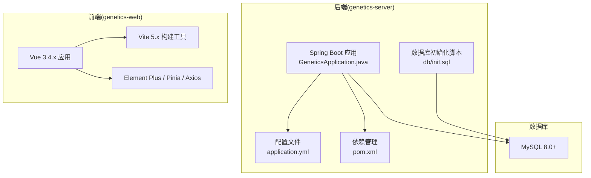
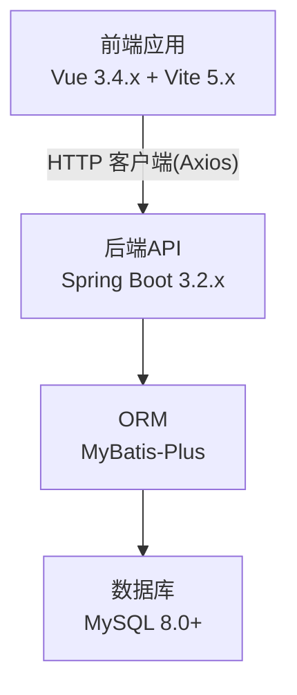
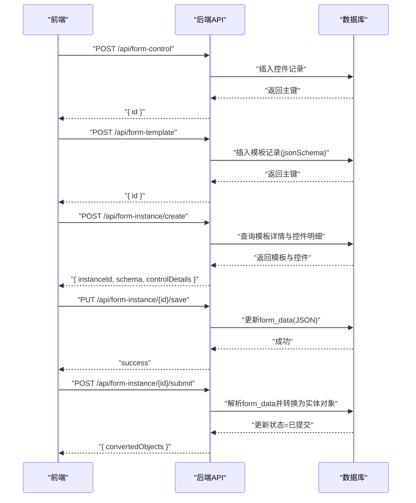
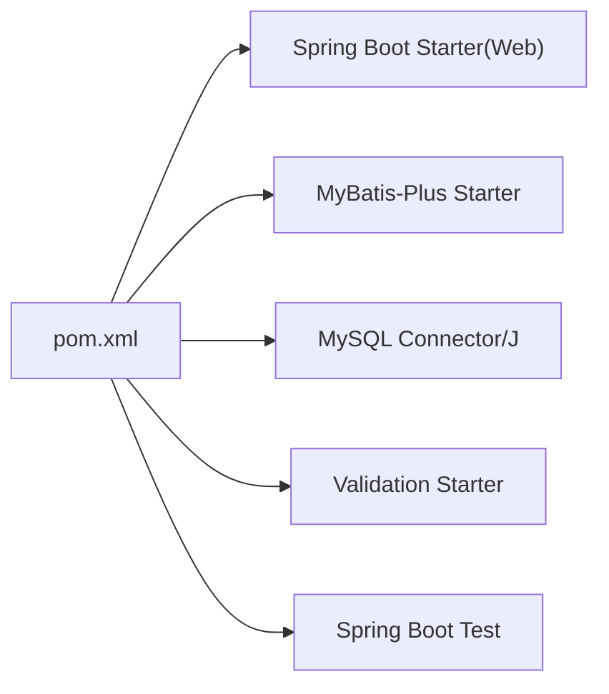

# 开发环境搭建

<cite>
**本文引用的文件**
- [VAT_EPR_动态表单技术方案.md](file://VAT_EPR_动态表单技术方案.md)
- [pom.xml](file://genetics-server/pom.xml)
- [application.yml](file://genetics-server/src/main/resources/application.yml)
- [init.sql](file://genetics-server/src/main/resources/db/init.sql)
- [GeneticsApplication.java](file://genetics-server/src/main/java/com/genetics/GeneticsApplication.java)
- [WebConfig.java](file://genetics-server/src/main/java/com/genetics/config/WebConfig.java)
</cite>

## 目录
1. [简介](#简介)
2. [项目结构](#项目结构)
3. [核心组件](#核心组件)
4. [架构总览](#架构总览)
5. [详细组件分析](#详细组件分析)
6. [依赖关系分析](#依赖关系分析)
7. [性能考虑](#性能考虑)
8. [故障排除指南](#故障排除指南)
9. [结论](#结论)
10. [附录](#附录)

## 简介
本指南面向VAT&EPR动态表单系统的开发者，提供从零开始搭建完整开发环境的操作步骤，涵盖以下内容：
- Java 21 与 Spring Boot 3.2.x 的安装与配置
- Node.js 与 Vue 3.4.x/Vite 5.x 的安装与配置
- MySQL 8.0+ 的安装、初始化与权限配置
- Git 使用与分支管理策略
- 开发工具推荐（IntelliJ IDEA、VS Code）及调试环境设置
- 常见环境问题排查与解决方案

## 项目结构
根据技术方案与现有配置文件，项目采用前后端分离架构：
- 后端：Spring Boot 3.2.x（Java 21），MyBatis-Plus，MySQL 8.0+
- 前端：Vue 3.4.x + Vite 5.x，Element Plus，Pinia，Axios
- 数据库：MySQL，提供初始化脚本与应用配置

图表来源
- [GeneticsApplication.java](file://genetics-server/src/main/java/com/genetics/GeneticsApplication.java)
- [application.yml](file://genetics-server/src/main/resources/application.yml)
- [pom.xml](file://genetics-server/pom.xml)
- [init.sql](file://genetics-server/src/main/resources/db/init.sql)

章节来源
- [VAT_EPR_动态表单技术方案.md](file://VAT_EPR_动态表单技术方案.md)
- [pom.xml](file://genetics-server/pom.xml)
- [application.yml](file://genetics-server/src/main/resources/application.yml)
- [init.sql](file://genetics-server/src/main/resources/db/init.sql)

## 核心组件
- 后端应用入口与扫描路径
  - 应用入口类负责启动Spring Boot应用并扫描Mapper包路径，确保MyBatis-Plus正确加载映射器。
- 数据源与ORM配置
  - application.yml中定义了MySQL连接参数、Jackson时区与日期格式、MyBatis-Plus全局配置（驼峰映射、逻辑删除字段、Mapper XML位置等）。
- 跨域配置
  - WebConfig统一开放跨域访问，便于前端本地开发调试。

章节来源
- [GeneticsApplication.java](file://genetics-server/src/main/java/com/genetics/GeneticsApplication.java)
- [application.yml](file://genetics-server/src/main/resources/application.yml)
- [WebConfig.java](file://genetics-server/src/main/java/com/genetics/config/WebConfig.java)

## 架构总览
系统采用前后端分离模式，后端提供REST API，前端通过HTTP客户端调用接口，实现动态表单的控件管理、模板设计与实例填写。

图表来源
- [VAT_EPR_动态表单技术方案.md](file://VAT_EPR_动态表单技术方案.md)
- [application.yml](file://genetics-server/src/main/resources/application.yml)

## 详细组件分析

### 后端环境准备（Spring Boot + Java 21 + MySQL）
- JDK 21 安装与环境变量
  - 下载并安装JDK 21，设置JAVA_HOME指向安装目录，将%PATH%加入bin目录。
  - 在命令行验证：java -version 与 javac -version。
- Maven 与依赖
  - 使用Maven管理依赖，确保pom.xml中的java.version为21，spring-boot-starter-parent版本为3.2.x系列。
- 数据库初始化
  - 使用init.sql创建数据库与表结构，包含自定义控件表、服务单模板表、服务单实例表。
  - 初始化脚本中包含示例控件数据，便于快速验证。
- 应用配置
  - application.yml中配置MySQL连接URL、用户名、密码、驱动类名、Jackson时区与日期格式、MyBatis-Plus全局配置（驼峰映射、逻辑删除字段、Mapper XML位置）。
- 启动与验证
  - 运行GeneticsApplication.java启动后端服务，默认监听8080端口。
  - 访问后端接口前需确保数据库已按init.sql初始化且application.yml中的连接参数正确。

章节来源
- [pom.xml](file://genetics-server/pom.xml)
- [application.yml](file://genetics-server/src/main/resources/application.yml)
- [init.sql](file://genetics-server/src/main/resources/db/init.sql)
- [GeneticsApplication.java](file://genetics-server/src/main/java/com/genetics/GeneticsApplication.java)

### 前端环境准备（Vue 3.4.x + Vite 5.x + Node.js）
- Node.js 安装
  - 安装Node.js LTS版本，确保npm可用。
  - 在命令行验证：node -v 与 npm -v。
- 项目依赖与构建
  - Vue 3.4.x + Vite 5.x + Element Plus + Pinia + Axios。
  - 使用npm/yarn/pnpm安装依赖并启动开发服务器。
- 跨域与代理
  - 后端已开启跨域，前端开发时可直接调用后端API（默认8080端口）。
  - 如需代理，请在Vite配置中添加代理规则以避免CORS问题。

章节来源
- [VAT_EPR_动态表单技术方案.md](file://VAT_EPR_动态表单技术方案.md)

### 数据库安装与配置（MySQL 8.0+）
- 安装
  - 安装MySQL 8.0+，启动服务并进入命令行。
- 初始化
  - 执行init.sql完成数据库与表结构创建，包含示例数据。
- 字符集与排序规则
  - 初始化脚本使用utf8mb4字符集与排序规则，确保多语言支持。
- 权限与用户
  - application.yml中使用root用户连接数据库，生产环境建议创建专用用户并限制权限。
- 连接参数
  - application.yml中包含时区、SSL、字符编码等参数，确保与数据库一致。

章节来源
- [init.sql](file://genetics-server/src/main/resources/db/init.sql)
- [application.yml](file://genetics-server/src/main/resources/application.yml)

### 版本控制与分支管理（Git）
- 基础操作
  - 新建仓库、添加远程、创建功能分支、提交与推送。
- 分支策略
  - 主分支用于发布稳定版本；功能开发在feature/*分支进行；修复bug在hotfix/*分支；版本标签使用release/*。
- 提交规范
  - 使用清晰的提交信息，遵循“类型: 内容”的格式，便于自动化与回溯。
- 冲突处理
  - 合并前先rebase或merge主分支，解决冲突后再推送。

章节来源
- [VAT_EPR_动态表单技术方案.md](file://VAT_EPR_动态表单技术方案.md)

### 开发工具与IDE配置
- IntelliJ IDEA（后端）
  - 导入Maven项目，自动解析依赖；配置JDK 21；启用Lombok插件；运行GeneticsApplication.java启动后端。
  - 推荐插件：MyBatis Log、Rainbow Brackets、String Manipulation。
- VS Code（前端）
  - 安装Volar、ESLint、Prettier、Auto Rename Tag等插件；配置Vue语言特性；使用Live Server或Vite Dev Server进行预览。
- 调试环境
  - 后端：设置断点于控制器与服务层；前端：在浏览器开发者工具中调试网络请求与组件状态。
- 插件与配置
  - 后端：启用Spring Boot Dashboard；前端：启用Vite插件与TypeScript支持（如使用TS）。

章节来源
- [VAT_EPR_动态表单技术方案.md](file://VAT_EPR_动态表单技术方案.md)
- [GeneticsApplication.java](file://genetics-server/src/main/java/com/genetics/GeneticsApplication.java)

### API 调用时序（后端接口）
以下时序图展示了前端调用后端接口的关键流程，便于理解开发与联调顺序。

图表来源
- [VAT_EPR_动态表单技术方案.md](file://VAT_EPR_动态表单技术方案.md)

## 依赖关系分析
后端依赖关系如下所示，体现了Spring Boot、MyBatis-Plus、MySQL驱动与测试框架之间的耦合。

图表来源
- [pom.xml](file://genetics-server/pom.xml)

章节来源
- [pom.xml](file://genetics-server/pom.xml)

## 性能考虑
- 数据库连接池与超时
  - 建议在生产环境配置连接池参数（如HikariCP），并设置合理的连接超时与空闲回收时间。
- 日志与监控
  - application.yml中已开启基础日志级别，建议在生产环境调整为info或warn，并接入集中式日志。
- ORM与SQL优化
  - MyBatis-Plus已启用驼峰映射与逻辑删除，建议为高频查询字段建立索引（如模板表的国家代码与服务代码组合索引）。
- 前端构建优化
  - 使用Vite的按需加载与Tree Shaking；生产打包时启用压缩与缓存策略。

章节来源
- [application.yml](file://genetics-server/src/main/resources/application.yml)
- [pom.xml](file://genetics-server/pom.xml)

## 故障排除指南
- 启动失败（端口占用）
  - 现象：端口8080被占用导致启动失败。
  - 处理：修改application.yml中的server.port或结束占用进程。
- 数据库连接异常
  - 现象：无法连接MySQL或认证失败。
  - 处理：核对application.yml中的url、username、password；确认MySQL服务已启动且防火墙未拦截3306端口。
- 初始化脚本执行失败
  - 现象：建库或建表报错。
  - 处理：确认MySQL版本满足8.0+要求；检查字符集与排序规则；以具备足够权限的用户执行init.sql。
- 跨域问题（CORS）
  - 现象：前端请求后端接口被浏览器拦截。
  - 处理：确认后端已启用跨域配置；前端代理或后端CORS策略需保持一致。
- Java 版本不匹配
  - 现象：编译或运行时报错，提示不支持的主版本。
  - 处理：确保IDE与Maven使用JDK 21；清理并重新构建项目。
- 前端依赖安装失败
  - 现象：npm install报错或依赖版本冲突。
  - 处理：更换镜像源（如cnpm/tnpm）；删除node_modules与lock文件后重装；升级Node.js至LTS版本。

章节来源
- [application.yml](file://genetics-server/src/main/resources/application.yml)
- [WebConfig.java](file://genetics-server/src/main/java/com/genetics/config/WebConfig.java)
- [init.sql](file://genetics-server/src/main/resources/db/init.sql)
- [pom.xml](file://genetics-server/pom.xml)

## 结论
通过以上步骤，您可以完成VAT&EPR动态表单系统的开发环境搭建。建议在本地先完成数据库初始化与后端启动，再进行前端开发与联调。遵循Git分支管理策略与提交规范，有助于团队协作与版本演进。遇到问题时，优先检查数据库连接、跨域配置与Java版本一致性。

## 附录
- 快速检查清单
  - JDK 21 已安装并配置环境变量
  - Maven 正常工作，依赖可正常解析
  - MySQL 8.0+ 已安装并执行init.sql
  - application.yml 中数据库连接参数正确
  - 后端应用可正常启动（端口8080）
  - 前端依赖安装完成，可启动开发服务器
  - Git 已配置用户信息并建立分支策略