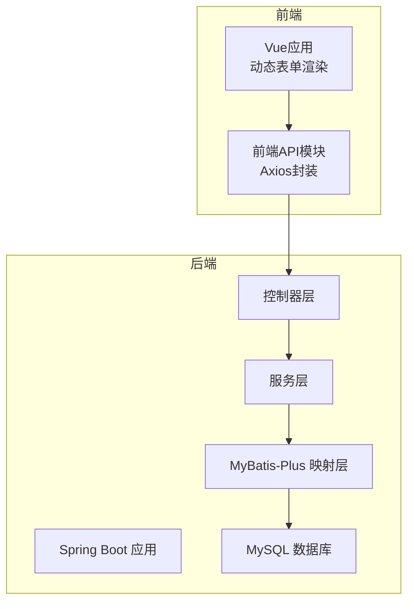
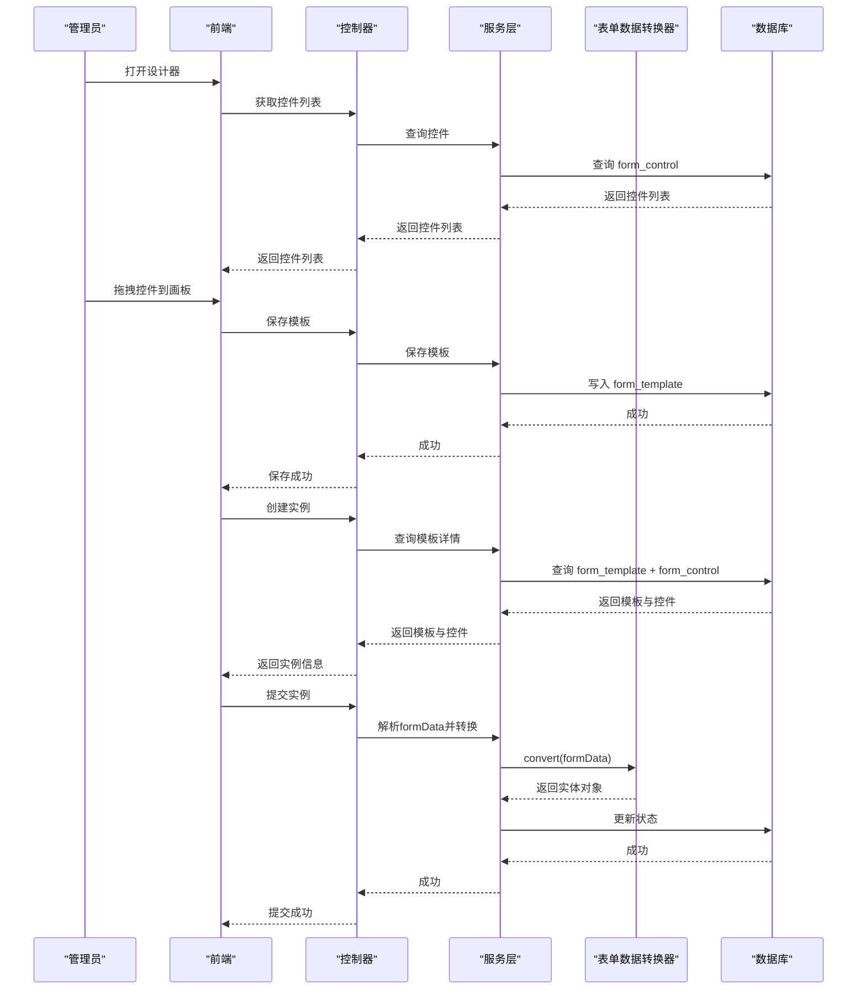
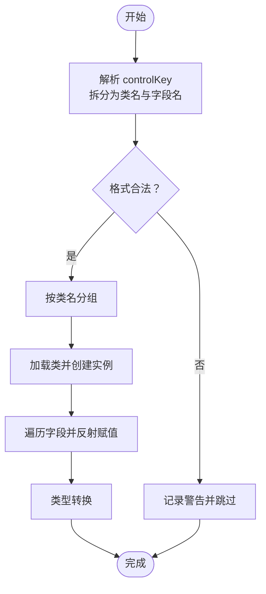
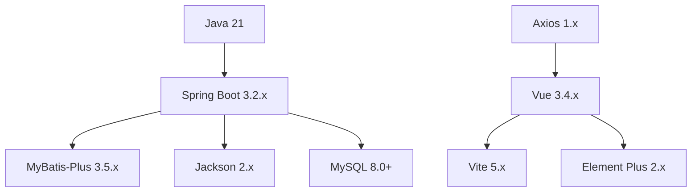

# 故障排除与常见问题

<cite>
**本文档引用的文件**
- [VAT_EPR_动态表单技术方案.md](file://VAT_EPR_动态表单技术方案.md)
</cite>

## 目录
1. [简介](#简介)
2. [项目结构](#项目结构)
3. [核心组件](#核心组件)
4. [架构总览](#架构总览)
5. [详细组件分析](#详细组件分析)
6. [依赖关系分析](#依赖关系分析)
7. [性能考虑](#性能考虑)
8. [故障排除指南](#故障排除指南)
9. [结论](#结论)
10. [附录](#附录)

## 简介
本指南面向开发与运维团队，围绕动态表单系统在开发与部署阶段可能遇到的各类问题，提供系统化的诊断思路与修复方案。内容涵盖数据库连接失败、端口占用冲突、跨域问题、文件上传失败、性能问题（内存泄漏、数据库查询慢、API响应超时）、日志查看与分析、调试工具使用、版本兼容性处理（Java版本升级、数据库版本迁移）、紧急回滚与数据恢复策略，以及知识库建设建议。

## 项目结构
系统采用前后端分离架构：
- 后端基于 Spring Boot 3.2.x + Java 21，使用 MyBatis-Plus 作为ORM，Jackson进行JSON序列化，Lombok简化代码。
- 前端基于 Vue 3.4.x + Vite 5.x + Element Plus 2.x，使用 Axios 1.x 进行HTTP通信。
- 数据库采用 MySQL 8.0+，表结构包含自定义控件表、服务单模板表、服务单实例表。

图表来源
- [VAT_EPR_动态表单技术方案.md: 773-852:773-852](file://VAT_EPR_动态表单技术方案.md#L773-L852)

章节来源
- [VAT_EPR_动态表单技术方案.md: 7-28:7-28](file://VAT_EPR_动态表单技术方案.md#L7-L28)
- [VAT_EPR_动态表单技术方案.md: 773-852:773-852](file://VAT_EPR_动态表单技术方案.md#L773-L852)

## 核心组件
- 表单数据转换器：负责将前端提交的 Map<controlKey, value> 转换为对应的业务实体对象，支持按类名分组与反射赋值。
- 控制器层：提供自定义控件、服务单模板、服务单实例、服务类目等接口。
- 服务层：封装业务逻辑，如模板发布、实例创建与提交、数据转换等。
- 映射层：基于 MyBatis-Plus 访问数据库，完成数据持久化。
- 前端动态表单：根据 json_schema 渲染控件，支持多种控件类型与校验规则。

章节来源
- [VAT_EPR_动态表单技术方案.md: 592-728:592-728](file://VAT_EPR_动态表单技术方案.md#L592-L728)
- [VAT_EPR_动态表单技术方案.md: 773-852:773-852](file://VAT_EPR_动态表单技术方案.md#L773-L852)

## 架构总览
系统整体交互流程如下：
- 管理员在前端设计器中配置控件与模板，后端保存模板与控件信息。
- 操作员选择模板创建实例，前端根据 json_schema 动态渲染表单。
- 用户填写表单并保存草稿或提交，后端解析 formData 并转换为实体对象，更新状态并触发后续业务。

图表来源
- [VAT_EPR_动态表单技术方案.md: 401-478:401-478](file://VAT_EPR_动态表单技术方案.md#L401-L478)
- [VAT_EPR_动态表单技术方案.md: 592-728:592-728](file://VAT_EPR_动态表单技术方案.md#L592-L728)

## 详细组件分析

### 表单数据转换器（FormDataConverter）
- 功能：将 Map<controlKey, value> 按类名分组，通过反射创建实体对象并赋值。
- 关键点：
  - controlKey 格式必须为 "ClassName.fieldName"。
  - 支持字符串、整数、长整型、布尔、大数等基础类型的转换。
  - 日志输出便于问题定位与审计。
- 常见问题与修复：
  - controlKey 格式不合法：检查前端提交的 controlKey 是否符合 "类名.字段名" 的格式。
  - 未注册的类名：在 CLASS_REGISTRY 中添加对应实体类映射。
  - 字段不存在：确认实体类字段名与 controlKey 的字段名一致。
  - 类型转换异常：检查前端传值类型与后端期望类型是否匹配。

图表来源
- [VAT_EPR_动态表单技术方案.md: 594-684:594-684](file://VAT_EPR_动态表单技术方案.md#L594-L684)

章节来源
- [VAT_EPR_动态表单技术方案.md: 594-684:594-684](file://VAT_EPR_动态表单技术方案.md#L594-L684)

### 控制器与服务层
- 控制器层提供 REST 接口，包括控件管理、模板管理、实例管理、类目联动等。
- 服务层负责业务逻辑编排，如模板发布、实例状态更新、数据转换等。
- 建议：
  - 在控制器层统一处理参数校验与异常返回。
  - 服务层增加幂等性与重试机制，避免重复提交导致的状态不一致。

章节来源
- [VAT_EPR_动态表单技术方案.md: 167-396:167-396](file://VAT_EPR_动态表单技术方案.md#L167-L396)
- [VAT_EPR_动态表单技术方案.md: 773-852:773-852](file://VAT_EPR_动态表单技术方案.md#L773-L852)

### 前端动态表单渲染
- 前端根据 json_schema 渲染控件，支持多种控件类型与校验规则。
- 文件上传控件读取 upload_config 配置（最大数量、允许类型、大小限制）。
- 建议：
  - 在前端对用户输入进行本地校验，减少无效请求。
  - 文件上传前进行容量与类型校验，避免后端压力过大。

章节来源
- [VAT_EPR_动态表单技术方案.md: 531-577:531-577](file://VAT_EPR_动态表单技术方案.md#L531-L577)
- [VAT_EPR_动态表单技术方案.md: 579-589:579-589](file://VAT_EPR_动态表单技术方案.md#L579-L589)

## 依赖关系分析
- 技术栈依赖：Spring Boot 3.2.x、Java 21、MySQL 8.0+、MyBatis-Plus 3.5.x、Jackson 2.x、Lombok、Vue 3.4.x、Element Plus 2.x、Vite 5.x、Axios 1.x。
- 版本兼容性：
  - Java 21 与 Spring Boot 3.2.x 兼容良好，注意移除过时的启动参数与配置。
  - MySQL 8.0+ 默认加密方式与驱动版本需匹配，避免连接失败。
  - 前端与后端版本升级需同步验证接口兼容性与样式一致性。

图表来源
- [VAT_EPR_动态表单技术方案.md: 7-28:7-28](file://VAT_EPR_动态表单技术方案.md#L7-L28)

章节来源
- [VAT_EPR_动态表单技术方案.md: 7-28:7-28](file://VAT_EPR_动态表单技术方案.md#L7-L28)

## 性能考虑
- 内存泄漏排查：
  - 使用 JVM 监控工具（如 JProfiler、VisualVM、Arthas）观察堆内存与GC行为。
  - 关注静态集合、线程池、缓存、反射对象的生命周期，避免持有不必要的引用。
- 数据库查询慢：
  - 为高频查询字段建立合适索引（如模板查询中的国家代码、服务编码、模板ID）。
  - 使用慢查询日志与执行计划分析，避免全表扫描与N+1查询。
- API响应超时：
  - 合理设置连接池大小与超时阈值，避免连接耗尽。
  - 对大字段（如json_schema、form_data）进行分页或延迟加载。
  - 异步化非关键路径（如日志、通知），减少主线程阻塞。

## 故障排除指南

### 数据库连接失败
- 症状：应用启动时报连接异常、SQL拒绝访问、认证失败。
- 诊断步骤：
  - 检查数据库服务状态与网络连通性。
  - 核对连接地址、端口、用户名、密码与数据库名是否正确。
  - 验证MySQL 8.0+的默认加密方式与驱动版本兼容性。
  - 查看数据库防火墙与安全组放行策略。
- 修复建议：
  - 更新连接参数与驱动版本，确保与MySQL 8.0+兼容。
  - 使用连接池监控工具（如HikariCP）观察连接状态与超时情况。
  - 如使用容器化部署，检查容器间网络与环境变量注入。

章节来源
- [VAT_EPR_动态表单技术方案.md: 13-14:13-14](file://VAT_EPR_动态表单技术方案.md#L13-L14)

### 端口占用冲突
- 症状：应用启动失败，提示端口被占用。
- 诊断步骤：
  - 使用系统命令查看占用端口的进程PID。
  - 确认是否为历史遗留进程或误开的其他服务。
- 修复建议：
  - 修改应用端口或释放占用端口的进程。
  - 在容器化环境中使用端口映射避免冲突。

### 跨域问题
- 症状：浏览器控制台出现CORS错误，接口无法访问。
- 诊断步骤：
  - 检查后端是否配置了正确的CORS策略（允许的源、方法、头信息）。
  - 确认前端请求的Origin是否在白名单内。
- 修复建议：
  - 在Spring Boot中启用全局CORS或针对特定路径配置。
  - 生产环境仅开放必要域名，避免使用通配符。

### 文件上传失败
- 症状：上传接口报错、文件未到达服务器或存储异常。
- 诊断步骤：
  - 检查前端上传控件的配置（最大数量、允许类型、大小限制）。
  - 确认后端接收参数与文件大小限制是否匹配。
  - 核对文件存储服务（如OSS/MinIO）的可用性与权限。
- 修复建议：
  - 前端预检文件类型与大小，减少无效请求。
  - 后端增加文件类型白名单与大小上限校验。
  - 使用异步上传与断点续传，提升用户体验与稳定性。

章节来源
- [VAT_EPR_动态表单技术方案.md: 541](file://VAT_EPR_动态表单技术方案.md#L541)
- [VAT_EPR_动态表单技术方案.md: 864](file://VAT_EPR_动态表单技术方案.md#L864)

### 表单数据转换异常
- 症状：提交后端报“对象转换失败”或字段缺失。
- 诊断步骤：
  - 检查 controlKey 格式是否为“类名.字段名”，且类名已在注册表中。
  - 确认实体类字段名与 controlKey 的字段名一致。
  - 核对前端传值类型与后端期望类型是否匹配。
- 修复建议：
  - 在 CLASS_REGISTRY 中补充缺失的实体类映射。
  - 前端统一字段命名规范，避免大小写与特殊字符差异。
  - 后端增强类型转换与字段存在性校验，输出明确错误信息。

章节来源
- [VAT_EPR_动态表单技术方案.md: 594-684:594-684](file://VAT_EPR_动态表单技术方案.md#L594-L684)
- [VAT_EPR_动态表单技术方案.md: 862](file://VAT_EPR_动态表单技术方案.md#L862)

### 模板发布后数据错乱
- 症状：模板发布后实例数据与新模板不匹配。
- 诊断步骤：
  - 检查模板版本管理策略，确认发布后不可修改 json_schema。
  - 核对实例表中的版本字段与模板版本是否一致。
- 修复建议：
  - 若需变更，创建新版本模板并引导用户切换。
  - 前端提示用户当前模板版本，避免误操作。

章节来源
- [VAT_EPR_动态表单技术方案.md: 860](file://VAT_EPR_动态表单技术方案.md#L860)

### 并发覆盖与状态不一致
- 症状：多用户同时保存实例导致数据被覆盖。
- 诊断步骤：
  - 检查实例保存接口是否使用乐观锁（version字段）。
  - 确认并发场景下的重试与幂等处理。
- 修复建议：
  - 在服务层实现乐观锁与重试机制。
  - 前端显示保存状态与冲突提示，避免重复提交。

章节来源
- [VAT_EPR_动态表单技术方案.md: 868](file://VAT_EPR_动态表单技术方案.md#L868)

### 日志查看与分析
- 建议：
  - 后端使用结构化日志（如JSON格式），便于采集与检索。
  - 关键路径（转换器、控制器、服务层）增加日志级别与上下文信息。
  - 使用集中式日志平台（如ELK/EFK）聚合与告警。
- 常见问题定位：
  - 控制器层：记录请求参数、响应状态码与异常堆栈。
  - 服务层：记录业务状态变更与关键耗时。
  - 转换器：记录 controlKey 校验、类名注册、字段赋值与异常。

章节来源
- [VAT_EPR_动态表单技术方案.md: 594-684:594-684](file://VAT_EPR_动态表单技术方案.md#L594-L684)

### 调试工具使用
- JVM层面：JProfiler、VisualVM、Arthas，用于内存、CPU、线程与GC分析。
- 网络层面：Wireshark、Charles、Fiddler，用于接口抓包与协议分析。
- 前端调试：浏览器开发者工具、Vue DevTools，用于渲染与事件追踪。
- 后端调试：Postman、Insomnia，用于接口测试与参数构造。

### 版本兼容性问题
- Java版本升级：
  - 升级至Java 21后，检查Spring Boot 3.2.x的兼容性与弃用API。
  - 更新构建脚本与CI/CD配置，确保打包与运行环境一致。
- 数据库版本迁移：
  - MySQL 8.0+默认加密方式变化，需同步更新驱动与连接参数。
  - 迁移前备份数据库，验证DDL与数据完整性。
- 前后端版本升级：
  - 同步更新依赖版本，进行回归测试与兼容性验证。
  - 逐步灰度发布，收集用户反馈与监控指标。

章节来源
- [VAT_EPR_动态表单技术方案.md: 7-28:7-28](file://VAT_EPR_动态表单技术方案.md#L7-L28)
- [VAT_EPR_动态表单技术方案.md: 13-14:13-14](file://VAT_EPR_动态表单技术方案.md#L13-L14)

### 紧急回滚与数据恢复
- 回滚策略：
  - 保留最近一次稳定版本的镜像与配置，快速回退。
  - 使用蓝绿/金丝雀发布，降低回滚风险。
- 数据恢复：
  - 定期备份数据库与关键配置，验证恢复流程。
  - 对重要表（模板、实例）进行增量备份，缩短RPO。
- 应急预案：
  - 准备应急联系人与处置流程，明确职责分工。
  - 建立自动化监控与告警，第一时间发现异常。

### 知识库建设
- 结构建议：
  - 按问题类型分类（数据库、网络、性能、安全等）。
  - 每个条目包含：问题现象、诊断步骤、修复方案、预防措施。
  - 附带相关日志片段与截图，便于快速定位。
- 维护建议：
  - 定期回顾与更新，剔除过时内容。
  - 与CI/CD集成，自动触发相关检查项。

## 结论
本指南从系统架构、核心组件、依赖关系与性能优化等方面出发，提供了面向开发与运维的故障排除与常见问题解决方案。建议在日常工作中结合日志与监控工具，建立标准化的诊断流程与知识库，持续提升系统的稳定性与可维护性。

## 附录
- 快速检查清单：
  - 数据库连接参数与驱动版本是否匹配。
  - 端口占用与防火墙策略是否正常。
  - CORS配置与前端请求Origin是否一致。
  - 文件上传类型、大小限制与存储服务可用性。
  - controlKey格式、类名注册与字段存在性。
  - 模板版本管理与实例状态更新策略。
  - 并发保存的乐观锁与重试机制。
  - 日志级别与集中式日志平台配置。
  - Java与MySQL版本兼容性与CI/CD配置。
  - 回滚策略与数据备份恢复流程。