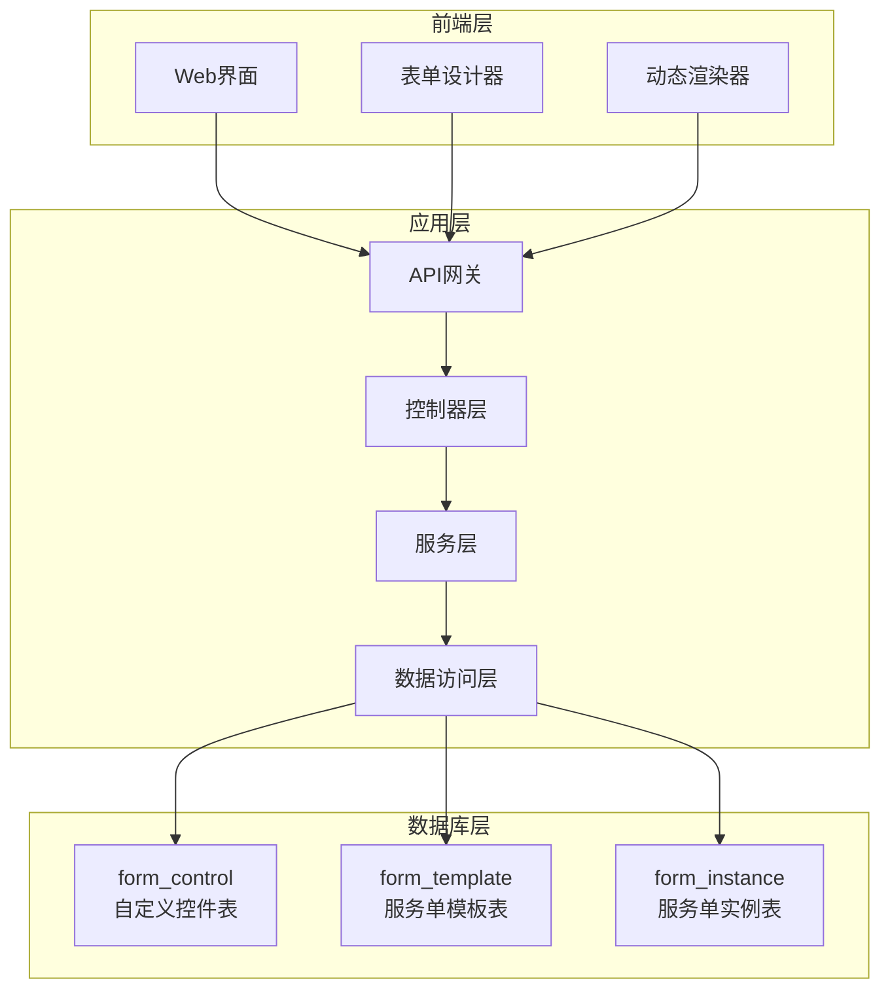
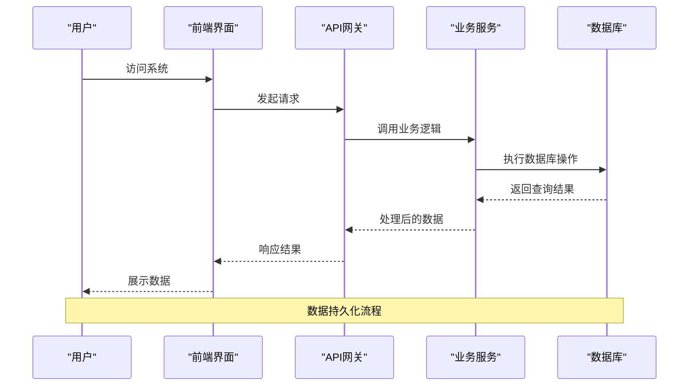
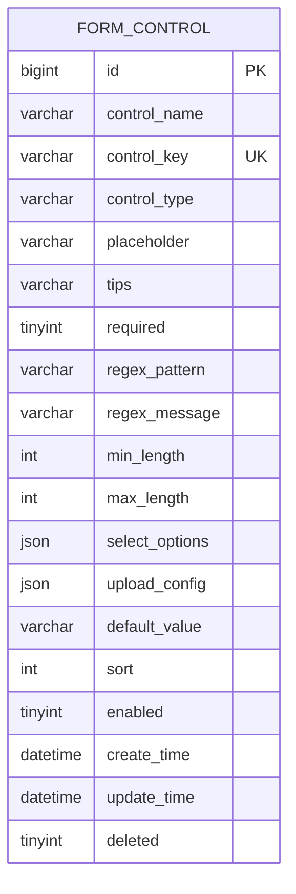
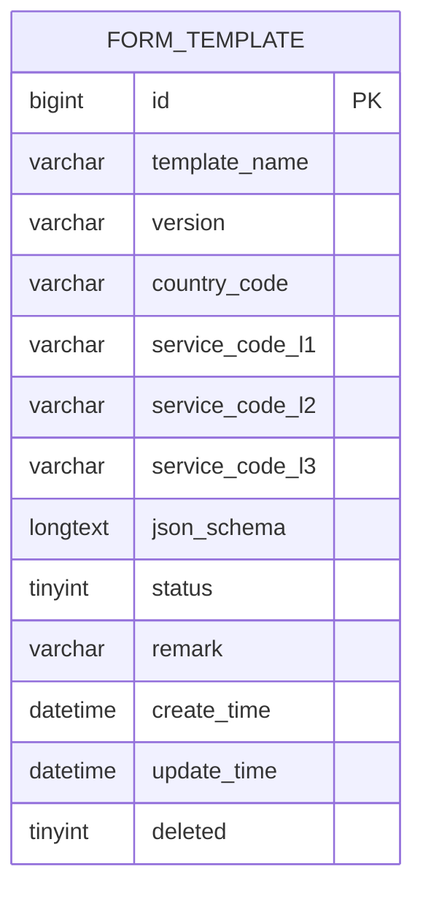
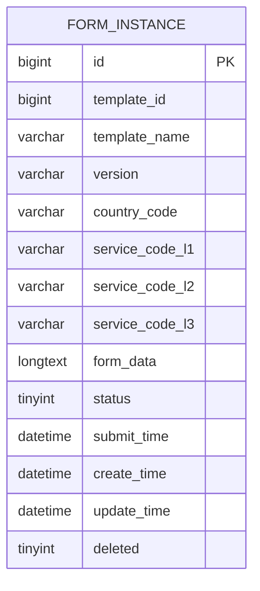
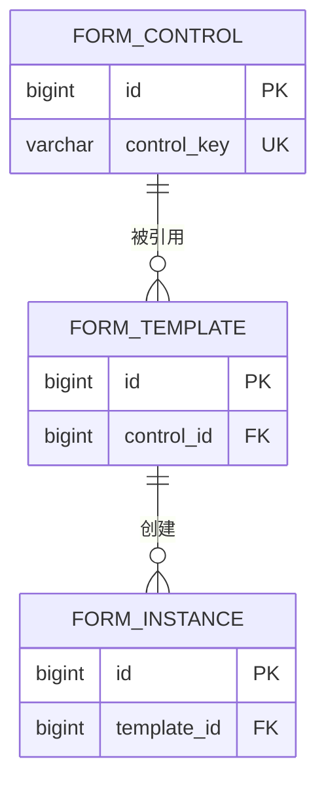

# 数据库初始化

<cite>
**本文档引用的文件**
- [VAT_EPR_动态表单技术方案.md](file://VAT_EPR_动态表单技术方案.md)
</cite>

## 目录
1. [简介](#简介)
2. [项目结构](#项目结构)
3. [核心组件](#核心组件)
4. [架构概览](#架构概览)
5. [详细组件分析](#详细组件分析)
6. [依赖关系分析](#依赖关系分析)
7. [性能考虑](#性能考虑)
8. [故障排除指南](#故障排除指南)
9. [结论](#结论)
10. [附录](#附录)

## 简介

本文档提供了VAT&EPR动态表单系统的完整数据库初始化和配置指南。该系统基于MySQL 8.0+构建，采用动态表单设计模式，通过JSON Schema实现灵活的表单布局和数据存储。系统包含三个核心表：`form_control`（自定义控件表）、`form_template`（服务单模板表）和`form_instance`（服务单实例表），支持复杂的业务场景和多级服务分类。

## 项目结构

基于技术方案文档，系统采用前后端分离架构，数据库作为核心数据存储层，负责持久化表单控件定义、模板布局和实例数据。



**图表来源**
- [VAT_EPR_动态表单技术方案.md: 31-163:31-163](file://VAT_EPR_动态表单技术方案.md#L31-L163)

**章节来源**
- [VAT_EPR_动态表单技术方案.md: 31-163:31-163](file://VAT_EPR_动态表单技术方案.md#L31-L163)

## 核心组件

### 数据库设计概述

系统采用MySQL 8.0+作为主要数据库，使用InnoDB存储引擎，字符集设置为utf8mb4，支持完整的UTF-8字符集，包括emoji表情符号。所有表都包含统一的审计字段：`create_time`、`update_time`和`deleted`，用于数据追踪和软删除。

### 表结构设计原则

1. **标准化设计**：避免重复数据，通过外键关系维护数据一致性
2. **灵活性**：使用JSON字段存储动态配置和数据，支持业务快速变化
3. **性能优化**：合理设置索引，平衡查询性能和写入性能
4. **可扩展性**：预留扩展字段，支持未来功能增强

**章节来源**
- [VAT_EPR_动态表单技术方案.md: 31-163:31-163](file://VAT_EPR_动态表单技术方案.md#L31-L163)

## 架构概览

系统采用三层架构设计，数据库层负责数据持久化，应用层处理业务逻辑，前端层提供用户界面。



**图表来源**
- [VAT_EPR_动态表单技术方案.md: 400-478:400-478](file://VAT_EPR_动态表单技术方案.md#L400-L478)

## 详细组件分析

### form_control 表（自定义控件表）

#### 表结构定义

`form_control`表是系统的核心控件定义表，支持多种类型的表单控件，包括输入框、选择框、开关、上传、文本域、日期和数字等。



**图表来源**
- [VAT_EPR_动态表单技术方案.md: 35-59:35-59](file://VAT_EPR_动态表单技术方案.md#L35-L59)

#### 字段详细说明

| 字段名 | 类型 | 约束 | 描述 |
|--------|------|------|------|
| id | BIGINT | NOT NULL AUTO_INCREMENT | 主键ID |
| control_name | VARCHAR(100) | NOT NULL | 控件名称（展示用） |
| control_key | VARCHAR(200) | NOT NULL UNIQUE | 控件key，格式: ClassName.fieldName |
| control_type | VARCHAR(30) | NOT NULL | 控件类型: INPUT/SELECT/SWITCH/UPLOAD/TEXTAREA/DATE/NUMBER |
| placeholder | VARCHAR(200) | DEFAULT NULL | 占位文本 |
| tips | VARCHAR(500) | DEFAULT NULL | 控件说明(TIPS) |
| required | TINYINT(1) | NOT NULL DEFAULT 0 | 是否必填: 0否 1是 |
| regex_pattern | VARCHAR(500) | DEFAULT NULL | 正则表达式约束 |
| regex_message | VARCHAR(200) | DEFAULT NULL | 正则校验失败提示语 |
| min_length | INT | DEFAULT NULL | 最小长度 |
| max_length | INT | DEFAULT NULL | 最大长度 |
| select_options | JSON | DEFAULT NULL | 下拉框选项配置 |
| upload_config | JSON | DEFAULT NULL | 上传文件配置 |
| default_value | VARCHAR(500) | DEFAULT NULL | 默认值 |
| sort | INT | NOT NULL DEFAULT 0 | 排序 |
| enabled | TINYINT(1) | NOT NULL DEFAULT 1 | 是否启用: 0否 1是 |
| create_time | DATETIME | NOT NULL DEFAULT CURRENT_TIMESTAMP | 创建时间 |
| update_time | DATETIME | NOT NULL DEFAULT CURRENT_TIMESTAMP ON UPDATE CURRENT_TIMESTAMP | 更新时间 |
| deleted | TINYINT(1) | NOT NULL DEFAULT 0 | 删除标记 |

#### 索引和约束

- **主键**: `PRIMARY KEY (id)`
- **唯一索引**: `UNIQUE KEY uk_control_key (control_key)`
- **字符集**: utf8mb4
- **引擎**: InnoDB

#### JSON字段使用

`select_options`和`upload_config`字段使用JSON数据类型，支持复杂的配置结构：

**select_options示例结构**：
```json
[
  {"label":"选项1","value":"val1"},
  {"label":"选项2","value":"val2"}
]
```

**upload_config示例结构**：
```json
{
  "maxCount":3,
  "accept":".pdf,.jpg,.png",
  "maxSizeMB":10
}
```

**章节来源**
- [VAT_EPR_动态表单技术方案.md: 35-59:35-59](file://VAT_EPR_动态表单技术方案.md#L35-L59)

### form_template 表（服务单模板表）

#### 表结构定义

`form_template`表存储服务单模板的完整定义，包括布局信息和业务配置。



**图表来源**
- [VAT_EPR_动态表单技术方案.md: 70-87:70-87](file://VAT_EPR_动态表单技术方案.md#L70-L87)

#### 字段详细说明

| 字段名 | 类型 | 约束 | 描述 |
|--------|------|------|------|
| id | BIGINT | NOT NULL AUTO_INCREMENT | 主键ID |
| template_name | VARCHAR(100) | NOT NULL | 服务单名称 |
| version | VARCHAR(20) | NOT NULL DEFAULT '1.0.0' | 服务单版本 |
| country_code | VARCHAR(10) | NOT NULL | 关联国家代码 |
| service_code_l1 | VARCHAR(10) | NOT NULL | 服务类型一级code |
| service_code_l2 | VARCHAR(10) | NOT NULL | 服务类型二级code |
| service_code_l3 | VARCHAR(10) | NOT NULL | 服务类型三级code |
| json_schema | LONGTEXT | NOT NULL | JSON Schema布局定义 |
| status | TINYINT(1) | NOT NULL DEFAULT 1 | 状态: 0草稿 1发布 |
| remark | VARCHAR(500) | DEFAULT NULL | 备注 |
| create_time | DATETIME | NOT NULL DEFAULT CURRENT_TIMESTAMP | 创建时间 |
| update_time | DATETIME | NOT NULL DEFAULT CURRENT_TIMESTAMP ON UPDATE CURRENT_TIMESTAMP | 更新时间 |
| deleted | TINYINT(1) | NOT NULL DEFAULT 0 | 删除标记 |

#### JSON Schema结构

`json_schema`字段存储完整的表单布局定义：

```json
{
  "layout": "grid",
  "columns": 2,
  "rows": [
    {
      "rowIndex": 0,
      "cells": [
        {
          "colSpan": 1,
          "controlId": 1,
          "controlKey": "Company.companyName",
          "controlType": "INPUT",
          "label": "公司名称"
        }
      ]
    }
  ]
}
```

**章节来源**
- [VAT_EPR_动态表单技术方案.md: 70-128:70-128](file://VAT_EPR_动态表单技术方案.md#L70-L128)

### form_instance 表（服务单实例表）

#### 表结构定义

`form_instance`表存储具体的表单实例数据，包含模板引用和实际填写的数据。



**图表来源**
- [VAT_EPR_动态表单技术方案.md: 134-153:134-153](file://VAT_EPR_动态表单技术方案.md#L134-L153)

#### 字段详细说明

| 字段名 | 类型 | 约束 | 描述 |
|--------|------|------|------|
| id | BIGINT | NOT NULL AUTO_INCREMENT | 主键ID |
| template_id | BIGINT | NOT NULL | 关联的服务单模板ID |
| template_name | VARCHAR(100) | NOT NULL | 服务单名称（冗余） |
| version | VARCHAR(20) | NOT NULL | 服务单版本（冗余） |
| country_code | VARCHAR(10) | NOT NULL | 国家代码（冗余） |
| service_code_l1 | VARCHAR(10) | NOT NULL | 一级服务类型code |
| service_code_l2 | VARCHAR(10) | NOT NULL | 二级服务类型code |
| service_code_l3 | VARCHAR(10) | NOT NULL | 三级服务类型code |
| form_data | LONGTEXT | NOT NULL | 表单数据，JSON格式 |
| status | TINYINT(1) | NOT NULL DEFAULT 0 | 状态: 0草稿 1已提交 2已审核 |
| submit_time | DATETIME | DEFAULT NULL | 提交时间 |
| create_time | DATETIME | NOT NULL DEFAULT CURRENT_TIMESTAMP | 创建时间 |
| update_time | DATETIME | NOT NULL DEFAULT CURRENT_TIMESTAMP ON UPDATE CURRENT_TIMESTAMP | 更新时间 |
| deleted | TINYINT(1) | NOT NULL DEFAULT 0 | 删除标记 |

#### form_data存储格式

`form_data`字段存储Map<controlKey, value>的JSON格式数据：

```json
{
  "Company.companyName": "测试公司有限公司",
  "Company.companyCountry": "DEU",
  "CompanyLegalPerson.companyLegalName": "张三"
}
```

**章节来源**
- [VAT_EPR_动态表单技术方案.md: 134-163:134-163](file://VAT_EPR_动态表单技术方案.md#L134-L163)

## 依赖关系分析

### 数据模型关系



**图表来源**
- [VAT_EPR_动态表单技术方案.md: 35-153:35-153](file://VAT_EPR_动态表单技术方案.md#L35-L153)

### 业务流程依赖

系统通过严格的依赖关系确保数据的一致性和完整性：

1. **控件依赖**：模板必须引用有效的控件定义
2. **模板依赖**：实例必须基于有效的模板创建
3. **数据依赖**：实例数据必须符合模板的JSON Schema定义

**章节来源**
- [VAT_EPR_动态表单技术方案.md: 35-153:35-153](file://VAT_EPR_动态表单技术方案.md#L35-L153)

## 性能考虑

### 索引优化策略

1. **主键索引**：所有表的主键自动创建聚簇索引
2. **唯一索引**：`form_control.control_key`确保控件标识唯一性
3. **普通索引**：`form_instance.template_id`支持按模板查询
4. **复合索引**：可根据查询需求创建复合索引优化复杂查询

### 查询性能优化

1. **JSON字段查询**：对于频繁查询的JSON字段，考虑将其规范化存储
2. **分页查询**：大量数据时使用LIMIT和OFFSET进行分页
3. **索引选择性**：优先对高选择性的字段建立索引
4. **查询优化**：避免SELECT *，只查询必要字段

### 存储引擎选择

- **InnoDB引擎**：支持事务、外键和行级锁定
- **字符集utf8mb4**：支持完整的UTF-8字符集，包括emoji
- **页大小**：默认16KB，适合大多数应用场景

## 故障排除指南

### 常见问题诊断

#### 控件唯一性冲突
**症状**：插入form_control时报唯一键冲突
**解决方案**：
1. 检查control_key格式是否正确（必须包含点号）
2. 确认control_key在数据库中不存在重复
3. 使用唯一性检查查询验证

#### 模板版本管理问题
**症状**：模板发布后无法修改json_schema
**解决方案**：
1. 创建新版本模板而非修改现有模板
2. 使用版本字段管理模板演进
3. 确保历史实例不受影响

#### JSON数据格式错误
**症状**：查询或更新JSON字段时报语法错误
**解决方案**：
1. 使用JSON_VALID()函数验证数据格式
2. 在应用层进行JSON数据验证
3. 使用JSON函数进行安全的数据操作

### 数据库连接问题

#### 连接超时
**症状**：数据库连接频繁超时
**解决方案**：
1. 检查网络连接稳定性
2. 调整连接池配置
3. 优化慢查询语句

#### 字符集问题
**症状**：中文显示为乱码
**解决方案**：
1. 确认数据库字符集设置为utf8mb4
2. 检查客户端字符集配置
3. 验证连接参数中的字符集设置

**章节来源**
- [VAT_EPR_动态表单技术方案.md: 856-869:856-869](file://VAT_EPR_动态表单技术方案.md#L856-L869)

## 结论

VAT&EPR动态表单系统通过精心设计的数据库架构实现了高度的灵活性和可扩展性。三个核心表的设计充分考虑了业务需求的复杂性和未来的扩展可能性。MySQL 8.0+的特性支持，特别是JSON数据类型和utf8mb4字符集，为系统的国际化和动态配置提供了坚实的技术基础。

系统的关键优势包括：
- 灵活的表单设计能力
- 完善的数据一致性保障
- 良好的性能表现
- 易于维护和扩展

通过遵循本文档提供的初始化和配置指南，可以确保系统数据库的正确部署和稳定运行。

## 附录

### 数据库初始化步骤

#### 1. 创建数据库和用户
```sql
-- 创建数据库
CREATE DATABASE IF NOT EXISTS genetics_db CHARACTER SET utf8mb4 COLLATE utf8mb4_unicode_ci;

-- 创建用户并授权
CREATE USER IF NOT EXISTS 'genetics_user'@'%' IDENTIFIED BY 'password';
GRANT ALL PRIVILEGES ON genetics_db.* TO 'genetics_user'@'%';
FLUSH PRIVILEGES;
```

#### 2. 设置数据库参数
```sql
-- 设置会话时区
SET time_zone = '+08:00';

-- 设置字符集
SET NAMES utf8mb4;
```

#### 3. 创建核心表
按照技术方案中的SQL脚本顺序执行表创建语句。

#### 4. 验证安装
```sql
-- 检查表是否存在
SHOW TABLES LIKE 'form_%';

-- 检查表结构
DESCRIBE form_control;
DESCRIBE form_template;
DESCRIBE form_instance;
```

### 配置验证清单

- [ ] 数据库连接正常
- [ ] 字符集设置为utf8mb4
- [ ] 时区设置正确
- [ ] 所有核心表创建完成
- [ ] 索引和约束正确设置
- [ ] 初始数据导入完成

### 备份和恢复策略

#### 定期备份
```bash
# 使用mysqldump进行全量备份
mysqldump -u genetics_user -p genetics_db > backup_$(date +%Y%m%d_%H%M%S).sql

# 备份特定表
mysqldump -u genetics_user -p genetics_db form_control > control_backup.sql
```

#### 恢复操作
```sql
-- 恢复数据库
mysql -u genetics_user -p genetics_db < backup.sql

-- 恢复特定表
mysql -u genetics_user -p genetics_db < control_backup.sql
```