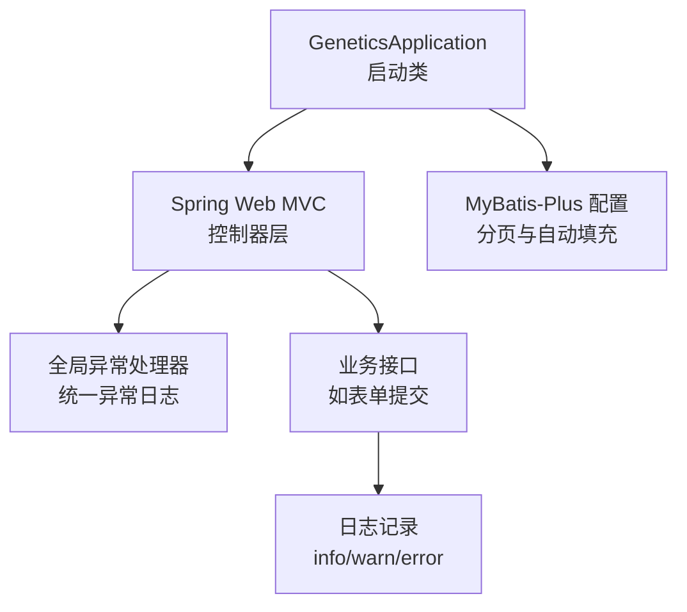
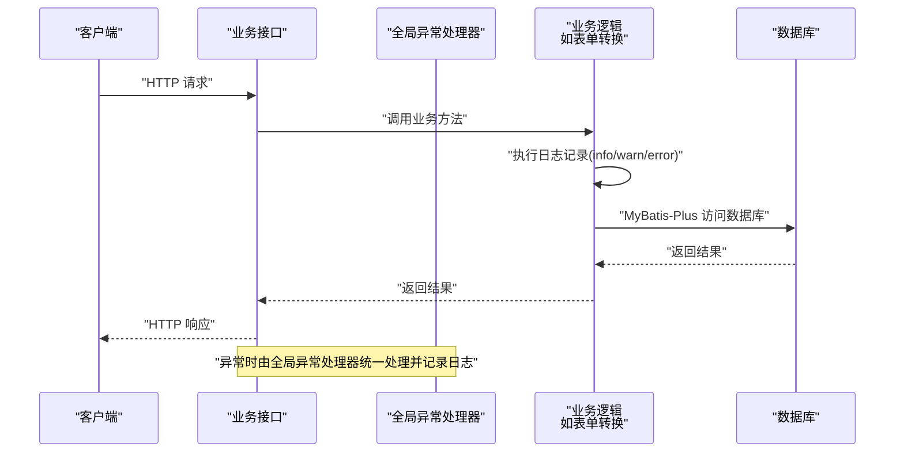
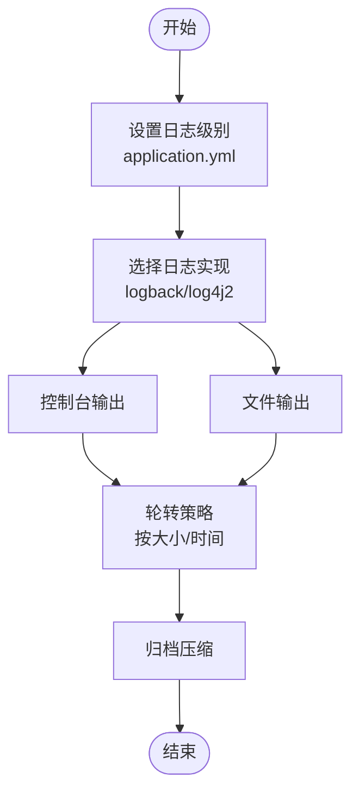
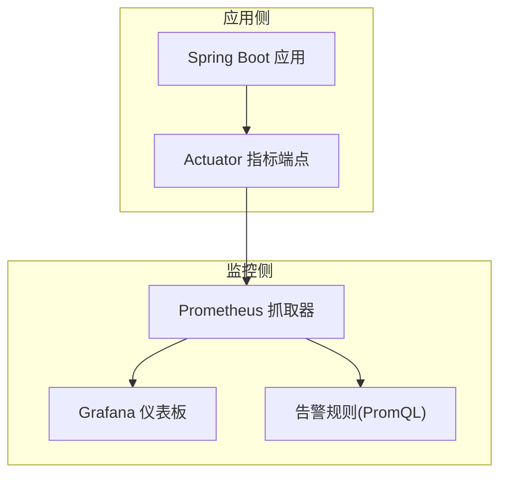
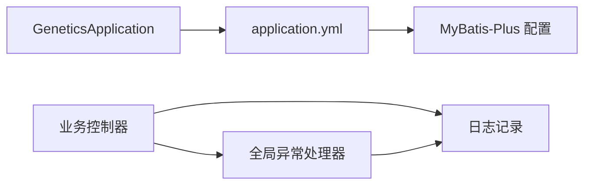

# 监控与日志管理

<cite>
**本文引用的文件**
- [application.yml](file://genetics-server/src/main/resources/application.yml)
- [pom.xml](file://genetics-server/pom.xml)
- [GeneticsApplication.java](file://genetics-server/src/main/java/com/genetics/GeneticsApplication.java)
- [MybatisPlusConfig.java](file://genetics-server/src/main/java/com/genetics/config/MybatisPlusConfig.java)
- [GlobalExceptionHandler.java](file://genetics-server/src/main/java/com/genetics/common/GlobalExceptionHandler.java)
- [FormDataConverter.java](file://VAT_EPR_动态表单技术方案.md)
</cite>

## 目录
1. [简介](#简介)
2. [项目结构](#项目结构)
3. [核心组件](#核心组件)
4. [架构总览](#架构总览)
5. [详细组件分析](#详细组件分析)
6. [依赖关系分析](#依赖关系分析)
7. [性能考虑](#性能考虑)
8. [故障排查指南](#故障排查指南)
9. [结论](#结论)
10. [附录](#附录)

## 简介
本指南面向Spring Boot应用的系统监控与日志管理，结合当前仓库中已有的配置与代码片段，给出可落地的日志配置、输出策略、轮转与归档建议，以及与Prometheus/Grafana集成的思路。同时涵盖数据库连接池状态、API响应时间与错误率的监控方案，并提供告警规则与通知机制的配置要点。最后补充前端错误监控与性能监控的实践建议，以及日志分析工具的使用方法与常见问题排查技巧。

## 项目结构
该仓库包含一个基于Spring Boot的后端服务工程，核心模块位于 genetics-server，包含以下与监控和日志相关的关键要素：
- 应用配置：application.yml 中定义了服务器端口、数据源、Jackson日期时间格式、MyBatis-Plus配置以及基础日志级别。
- 构建配置：pom.xml 定义了Web、MyBatis-Plus、MySQL驱动等依赖。
- 应用入口：GeneticsApplication.java 启动类。
- ORM配置：MybatisPlusConfig.java 提供分页插件与元对象自动填充。
- 全局异常处理：GlobalExceptionHandler.java 统一处理校验异常、非法参数、运行时异常与通用异常，并记录日志。
- 日志使用示例：FormDataConverter.java 在转换流程中使用日志记录警告、信息与错误。

**图表来源**
- [GeneticsApplication.java:1-13](file://genetics-server/src/main/java/com/genetics/GeneticsApplication.java#L1-L13)
- [MybatisPlusConfig.java:1-36](file://genetics-server/src/main/java/com/genetics/config/MybatisPlusConfig.java#L1-L36)
- [GlobalExceptionHandler.java:1-52](file://genetics-server/src/main/java/com/genetics/common/GlobalExceptionHandler.java#L1-L52)
- [FormDataConverter.java:602-684](file://VAT_EPR_动态表单技术方案.md#L602-L684)

**章节来源**
- [application.yml:1-32](file://genetics-server/src/main/resources/application.yml#L1-L32)
- [pom.xml:1-85](file://genetics-server/pom.xml#L1-L85)
- [GeneticsApplication.java:1-13](file://genetics-server/src/main/java/com/genetics/GeneticsApplication.java#L1-L13)
- [MybatisPlusConfig.java:1-36](file://genetics-server/src/main/java/com/genetics/config/MybatisPlusConfig.java#L1-L36)
- [GlobalExceptionHandler.java:1-52](file://genetics-server/src/main/java/com/genetics/common/GlobalExceptionHandler.java#L1-L52)
- [FormDataConverter.java:602-684](file://VAT_EPR_动态表单技术方案.md#L602-L684)

## 核心组件
- 应用配置(application.yml)
  - server.port：服务监听端口
  - spring.datasource.*：数据库连接信息
  - spring.jackson.*：日期格式、时区、属性过滤策略
  - mybatis-plus.configuration.log-impl：MyBatis SQL日志实现
  - logging.level.com.genetics：包级日志级别
- 构建配置(pom.xml)
  - spring-boot-starter-web：Web栈
  - mybatis-plus-boot-starter：ORM增强
  - mysql-connector-j：数据库驱动
  - spring-boot-starter-validation：参数校验
- 全局异常处理(GlobalExceptionHandler)
  - 统一捕获校验异常、绑定异常、非法参数、运行时异常与通用异常，记录warn/error日志并返回标准化结果
- 日志使用示例(FormDataConverter)
  - 使用日志记录警告、信息与错误，便于问题定位与审计

**章节来源**
- [application.yml:1-32](file://genetics-server/src/main/resources/application.yml#L1-L32)
- [pom.xml:26-66](file://genetics-server/pom.xml#L26-L66)
- [GlobalExceptionHandler.java:1-52](file://genetics-server/src/main/java/com/genetics/common/GlobalExceptionHandler.java#L1-L52)
- [FormDataConverter.java:602-684](file://VAT_EPR_动态表单技术方案.md#L602-L684)

## 架构总览
下图展示了从请求进入、业务处理到日志输出的整体路径，以及与数据库访问的关系：

**图表来源**
- [GlobalExceptionHandler.java:1-52](file://genetics-server/src/main/java/com/genetics/common/GlobalExceptionHandler.java#L1-L52)
- [FormDataConverter.java:602-684](file://VAT_EPR_动态表单技术方案.md#L602-L684)
- [application.yml:17-27](file://genetics-server/src/main/resources/application.yml#L17-L27)

## 详细组件分析

### 日志配置与输出策略
- 包级日志级别
  - 当前配置将 com.genetics 包的日志级别设为 debug，便于开发与测试阶段快速定位问题；生产环境建议调整为 info 或 warn。
- MyBatis SQL日志
  - 配置了标准输出的SQL日志实现，适合开发调试；生产环境建议关闭或切换到文件输出并配合日志轮转。
- 控制台与文件输出
  - Spring Boot默认会将日志输出到控制台；若需落盘，可在配置中启用文件输出与自定义格式。
- 输出格式定制
  - 可通过日志框架配置文件（如logback或log4j2）定义包含时间戳、线程名、级别、类名与消息的格式。
- 日志级别控制
  - 通过 application.yml 的 logging.level.* 进行按包或按类的细粒度控制；也可在运行时通过外部配置覆盖。
- 文件日志与控制台日志策略
  - 建议生产环境同时开启文件日志与控制台日志，以便于运维与开发双通道查看。
- 日志轮转与归档
  - 推荐使用基于时间或大小的滚动策略，保留N份历史文件并压缩归档，避免磁盘占用过大。

**章节来源**
- [application.yml:17-31](file://genetics-server/src/main/resources/application.yml#L17-L31)
- [FormDataConverter.java:602-684](file://VAT_EPR_动态表单技术方案.md#L602-L684)

### 数据库连接池状态监控
- 连接池健康检查
  - 通过Spring Boot Actuator暴露的数据源指标（如活跃连接数、空闲连接数、获取等待时间等）进行监控。
- 连接池告警
  - 当活跃连接超过阈值或等待时间异常升高时触发告警，提示可能的连接泄漏或资源瓶颈。
- 优化建议
  - 结合慢查询日志与事务超时配置，定位热点SQL与长事务，减少连接争用。

### API响应时间与错误率监控
- 响应时间
  - 采集各接口的请求耗时分布（P50/P95/P99），识别慢调用。
- 错误率
  - 统计4xx/5xx错误占比，结合全局异常处理器的错误日志进行交叉验证。
- 采样与聚合
  - 对高频接口采用降采样策略，降低指标开销；对关键路径保持全量采集。

### Prometheus与Grafana集成方案
- 指标导出
  - 引入Spring Boot Actuator，启用HTTP端点暴露JVM、数据源、Web请求等指标。
- 抓取配置
  - 在Prometheus中配置抓取目标，设置合适的抓取间隔与超时。
- 可视化仪表板
  - 在Grafana中创建仪表板，展示连接池状态、请求延迟、错误率、吞吐量等关键指标。
- 告警规则
  - 基于PromQL编写告警规则，例如连接池空闲率过低、响应时间超阈、错误率突增等。

[此图为概念性架构示意，不直接映射具体源码文件，故无“图表来源”标注]

### 告警规则与通知机制
- 规则示例
  - 连接池活跃连接数占比 > 阈值
  - API P95 响应时间 > 阈值
  - 错误率 > 阈值
- 通知渠道
  - 邮件、企业微信、钉钉机器人、Slack等；确保多通道冗余。
- 告警收敛
  - 对同一指标的重复告警进行去重与静默周期设置，避免噪声。

[本节为通用实践说明，未直接分析具体源码文件，故无“章节来源”标注]

### 前端错误监控与性能监控
- 错误监控
  - 使用前端错误上报SDK（如Sentry、Bugsnag或自研上报接口），采集JS异常、网络错误、资源加载失败等。
- 性能监控
  - 采集首屏时间、交互时间、页面停留时长等指标，结合后端接口响应时间进行端到端分析。
- 用户画像
  - 关联用户行为与错误分布，定位特定版本或用户的异常集中区域。

[本节为通用实践说明，未直接分析具体源码文件，故无“章节来源”标注]

### 日志分析工具与常见问题排查
- 工具推荐
  - ELK Stack（Elasticsearch/Filebeat/Logstash/Kibana）、Loki+Promtail+Grafana、Splunk等。
- 常见问题
  - 日志丢失：检查输出策略与权限，确认轮转配置正确。
  - 日志风暴：排查高频warn/error，必要时临时提升级别或限流。
  - 查找根因：结合traceId/spanId串联请求链路，定位异常发生的具体位置。
- 排查步骤
  - 快速定位：根据错误级别筛选
  - 深入分析：查看堆栈、上下文参数、数据库SQL
  - 复现验证：在测试环境复现并修复

[本节为通用实践说明，未直接分析具体源码文件，故无“章节来源”标注]

## 依赖关系分析
- 应用启动与配置
  - GeneticsApplication 启动Spring Boot应用，扫描Mapper包。
  - application.yml 提供服务器、数据源、Jackson与MyBatis-Plus的基础配置。
- ORM与日志
  - MybatisPlusConfig 提供分页与自动填充；application.yml 中的 log-impl 决定SQL日志输出方式。
- 异常与日志
  - GlobalExceptionHandler 统一处理异常并记录日志，保障错误信息可追踪。

**图表来源**
- [GeneticsApplication.java:1-13](file://genetics-server/src/main/java/com/genetics/GeneticsApplication.java#L1-L13)
- [application.yml:1-32](file://genetics-server/src/main/resources/application.yml#L1-L32)
- [MybatisPlusConfig.java:1-36](file://genetics-server/src/main/java/com/genetics/config/MybatisPlusConfig.java#L1-L36)
- [GlobalExceptionHandler.java:1-52](file://genetics-server/src/main/java/com/genetics/common/GlobalExceptionHandler.java#L1-L52)

**章节来源**
- [GeneticsApplication.java:1-13](file://genetics-server/src/main/java/com/genetics/GeneticsApplication.java#L1-L13)
- [application.yml:1-32](file://genetics-server/src/main/resources/application.yml#L1-L32)
- [MybatisPlusConfig.java:1-36](file://genetics-server/src/main/java/com/genetics/config/MybatisPlusConfig.java#L1-L36)
- [GlobalExceptionHandler.java:1-52](file://genetics-server/src/main/java/com/genetics/common/GlobalExceptionHandler.java#L1-L52)

## 性能考虑
- 日志级别与输出
  - 生产环境建议将包级日志级别上调至 info/warn，避免过多 debug 日志影响I/O性能。
- SQL日志
  - 开发阶段可开启SQL日志，生产环境建议关闭或限制到慢查询级别。
- 连接池参数
  - 合理设置最大连接数、空闲超时、获取超时，避免频繁创建/销毁连接。
- 指标采集
  - 对高QPS接口采用降采样，避免Prometheus抓取压力过大。

[本节为通用指导，未直接分析具体源码文件，故无“章节来源”标注]

## 故障排查指南
- 全局异常处理
  - 通过 GlobalExceptionHandler 的日志输出定位异常类型与参数，结合请求上下文快速定位问题。
- 日志级别
  - 若出现大量日志导致性能下降，临时提升日志级别或关闭SQL日志以减轻负担。
- 数据库连接
  - 关注数据源指标，排查连接池耗尽、慢查询与事务锁等待等问题。
- 前端问题
  - 结合前端错误上报与后端日志，定位跨端异常与性能瓶颈。

**章节来源**
- [GlobalExceptionHandler.java:1-52](file://genetics-server/src/main/java/com/genetics/common/GlobalExceptionHandler.java#L1-L52)
- [application.yml:17-31](file://genetics-server/src/main/resources/application.yml#L17-L31)

## 结论
本指南基于现有配置与代码，给出了日志配置、输出策略、轮转归档、数据库连接池与API性能监控、Prometheus/Grafana集成、告警规则与通知机制的实施建议，并补充了前端监控与日志分析工具的使用方法。建议在生产环境中逐步引入文件日志、SQL慢查询日志、Actuator指标导出与可视化仪表板，并建立完善的告警与通知机制，持续优化系统稳定性与可观测性。

## 附录
- 配置文件与依赖清单
  - application.yml：服务器端口、数据源、Jackson、MyBatis-Plus与日志级别
  - pom.xml：Web、MyBatis-Plus、MySQL驱动、校验与测试依赖
- 快速检查清单
  - 日志级别是否符合环境要求
  - 是否启用文件日志与轮转
  - Actuator指标端点是否可用
  - Grafana仪表板是否包含关键指标
  - 告警规则是否覆盖关键阈值
  - 前端错误上报是否接入

**章节来源**
- [application.yml:1-32](file://genetics-server/src/main/resources/application.yml#L1-L32)
- [pom.xml:26-66](file://genetics-server/pom.xml#L26-L66)