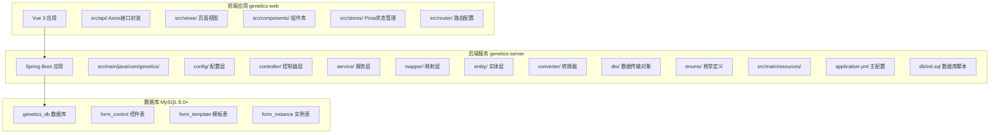
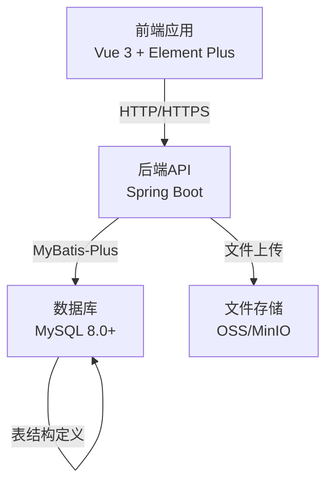
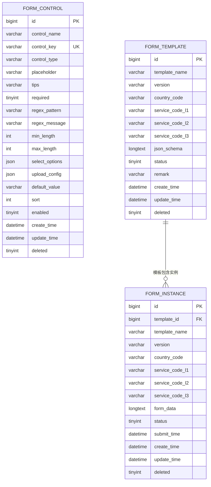
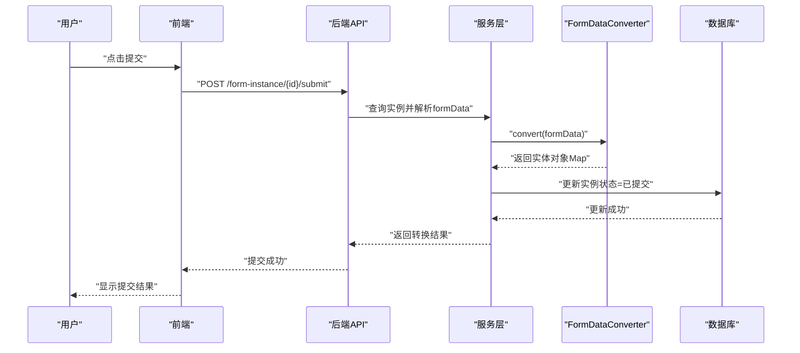
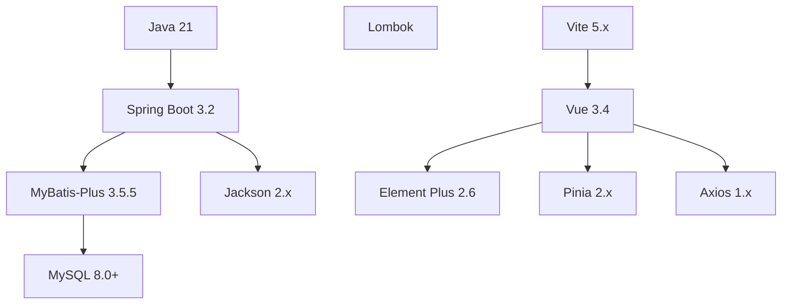

# 部署配置指南

<cite>
**本文档引用的文件**
- [README.md](file://README.md)
- [VAT_EPR_动态表单技术方案.md](file://VAT_EPR_动态表单技术方案.md)
- [application.yml](file://genetics-server/src/main/resources/application.yml)
- [init.sql](file://genetics-server/src/main/resources/db/init.sql)
- [package.json](file://genetics-web/package.json)
</cite>

## 更新摘要
**变更内容**
- 新增完整的数据库初始化步骤和配置说明
- 添加数据库连接配置详解和环境变量设置
- 补充后端Spring Boot应用启动命令和Swagger UI访问方式
- 完善前端Vue 3应用启动流程和开发服务器配置
- 增加项目结构图和快速开始指南
- 补充核心功能和技术栈说明

## 目录
1. [简介](#简介)
2. [项目结构](#项目结构)
3. [技术栈概览](#技术栈概览)
4. [核心组件](#核心组件)
5. [架构总览](#架构总览)
6. [详细组件分析](#详细组件分析)
7. [部署流程](#部署流程)
8. [数据库配置](#数据库配置)
9. [后端启动配置](#后端启动配置)
10. [前端启动配置](#前端启动配置)
11. [接口文档访问](#接口文档访问)
12. [依赖关系分析](#依赖关系分析)
13. [性能考虑](#性能考虑)
14. [故障排除指南](#故障排除指南)
15. [结论](#结论)
16. [附录](#附录)

## 简介
本指南面向运维工程师与开发团队，提供VAT&EPR动态表单系统的完整部署配置方案。系统基于Spring Boot 3.2 + Vue 3技术栈，支持自定义控件、拖拽式表单设计、服务单全生命周期管理。内容涵盖环境准备、数据库初始化、前后端构建与部署、容器化与Kubernetes编排、监控与日志管理、以及生产级安全与性能优化建议。

## 项目结构
根据README.md文档，系统采用前后端分离架构，分为后端服务(genetics-server)与前端应用(genetics-web)两个主要模块：



**章节来源**
- [README.md:18-46](file://README.md#L18-L46)

## 技术栈概览
系统采用现代化的技术栈组合，确保高性能和良好的开发体验：

| 层次 | 技术 | 版本 | 用途 |
|------|------|------|------|
| 后端框架 | Spring Boot | 3.2 | 应用框架 |
| 后端框架 | Java | 21 | 开发语言 |
| ORM | MyBatis-Plus | 3.5.5 | 数据持久化 |
| 数据库 | MySQL | 8.0+ | 关系型数据库 |
| 接口文档 | springdoc-openapi | 2.4 | Swagger UI |
| 前端框架 | Vue 3 | 3.4 | 用户界面 |
| 前端框架 | Vite | 5 | 构建工具 |
| UI组件库 | Element Plus | 2.6 | 组件库 |
| 状态管理 | Pinia | 2.1 | 状态管理 |
| 拖拽 | vuedraggable | 4.1 | 拖拽功能 |

**章节来源**
- [README.md:5-17](file://README.md#L5-L17)

## 核心组件
系统包含以下核心组件：

- **数据库层**：包含form_control、form_template、form_instance三张核心表，支持JSON Schema布局与动态表单数据存储
- **服务端核心**：
  - FormDataConverter：负责将Map<controlKey,value>转换为业务实体对象
  - 控制器层：提供控件、模板、实例、基础数据的REST接口
  - 服务层：封装业务逻辑，处理模板发布、实例创建、数据保存与提交
  - 映射层：MyBatis-Plus Mapper实现数据库访问
- **前端核心**：
  - 动态表单渲染：基于JSON Schema生成网格布局
  - 表单设计器：左侧控件面板与右侧画板，支持拖拽布局
  - 状态管理：Pinia管理设计器与实例填写状态

**章节来源**
- [README.md:90-137](file://README.md#L90-L137)
- [VAT_EPR_动态表单技术方案.md:31-163](file://VAT_EPR_动态表单技术方案.md#L31-L163)

## 架构总览
系统采用前后端分离架构，前端通过Axios调用后端REST接口；后端基于Spring Boot提供统一API，使用MyBatis-Plus进行数据持久化；数据库采用MySQL 8.0+，支持JSON字段存储复杂结构。



**章节来源**
- [VAT_EPR_动态表单技术方案.md:10-28](file://VAT_EPR_动态表单技术方案.md#L10-L28)

## 详细组件分析

### 数据库初始化与表结构
系统包含三张核心表，支持完整的动态表单生命周期管理：



**图表来源**
- [init.sql:8-72](file://genetics-server/src/main/resources/db/init.sql#L8-L72)

**章节来源**
- [init.sql:8-80](file://genetics-server/src/main/resources/db/init.sql#L8-L80)

### 表单提交与对象转换流程
提交流程包括：解析formData JSON、调用FormDataConverter进行对象转换、打印转换结果日志、更新实例状态为"已提交"。



**章节来源**
- [VAT_EPR_动态表单技术方案.md:705-728](file://VAT_EPR_动态表单技术方案.md#L705-L728)

### 动态表单渲染与数据存储
- JSON Schema定义网格布局(columns/rows/cells)，每个cell包含controlId、controlKey、controlType与label
- 前端根据controlType渲染对应组件(Input/Select/Switch/Upload/Textarea/Date/Number)，并维护formData对象
- 后端将formData序列化为JSON存入form_instance.form_data字段，key命名规范为"ClassName.fieldName"

**章节来源**
- [VAT_EPR_动态表单技术方案.md:531-589](file://VAT_EPR_动态表单技术方案.md#L531-L589)

## 部署流程
系统提供完整的快速开始指南，支持本地开发环境的快速搭建。

### 1. 初始化数据库
在MySQL中执行初始化脚本，创建数据库和表结构：

```bash
mysql -u root -p < genetics-server/src/main/resources/db/init.sql
```

**章节来源**
- [README.md:50-56](file://README.md#L50-L56)

### 2. 配置数据库连接
修改后端配置文件，设置数据库连接参数：

```yaml
spring:
  datasource:
    url: jdbc:mysql://localhost:3306/genetics_db?useUnicode=true&characterEncoding=utf8&useSSL=false&serverTimezone=Asia/Shanghai
    username: root
    password: 你的密码
```

**章节来源**
- [README.md:58-68](file://README.md#L58-L68)
- [application.yml:6-11](file://genetics-server/src/main/resources/application.yml#L6-L11)

### 3. 启动后端服务
进入后端目录，使用Maven启动Spring Boot应用：

```bash
cd genetics-server
mvn spring-boot:run
```

后端启动后可通过Swagger UI访问接口文档：http://localhost:8080/swagger-ui.html

**章节来源**
- [README.md:70-78](file://README.md#L70-L78)

### 4. 启动前端应用
进入前端目录，安装依赖并启动开发服务器：

```bash
cd genetics-web
npm install
npm run dev
```

前端启动后访问：http://localhost:5173

**章节来源**
- [README.md:80-88](file://README.md#L80-L88)
- [package.json:5-8](file://genetics-web/package.json#L5-L8)

## 数据库配置
系统使用MySQL 8.0+作为数据存储，配置文件中包含了完整的数据库连接参数设置。

### 数据库连接参数详解
- **URL配置**：包含字符集、SSL禁用、时区设置等参数
- **用户名密码**：默认root用户，需根据实际环境修改
- **驱动类名**：com.mysql.cj.jdbc.Driver
- **时区设置**：Asia/Shanghai

### 数据库初始化脚本
初始化脚本包含完整的DDL语句，创建数据库、表结构和示例数据：

- 创建genetics_db数据库
- 创建form_control、form_template、form_instance三张表
- 插入示例控件数据

**章节来源**
- [application.yml:6-11](file://genetics-server/src/main/resources/application.yml#L6-L11)
- [init.sql:5-80](file://genetics-server/src/main/resources/db/init.sql#L5-L80)

## 后端启动配置
后端采用Spring Boot 3.2框架，默认端口8080，配置了完整的应用参数。

### 应用配置参数
- **服务器端口**：8080
- **上下文路径**：/
- **时区设置**：Asia/Shanghai
- **日期格式**：yyyy-MM-dd HH:mm:ss
- **Jackson配置**：非空字段过滤、默认属性包含策略

### MyBatis-Plus配置
- **驼峰命名映射**：开启下划线到驼峰的自动转换
- **日志输出**：StdOutImpl标准输出日志
- **逻辑删除**：deleted字段逻辑删除配置
- **ID策略**：自增ID
- **Mapper位置**：classpath*:mapper/**/*.xml

### Swagger UI配置
- **路径**：/swagger-ui.html
- **标签排序**：alpha字母排序
- **操作排序**：alpha字母排序
- **扫描包**：com.genetics.controller

**章节来源**
- [application.yml:1-41](file://genetics-server/src/main/resources/application.yml#L1-L41)

## 前端启动配置
前端采用Vue 3 + Vite 5技术栈，提供现代化的开发体验。

### 项目依赖
- **核心依赖**：vue@3.4、vue-router@4.3、pinia@2.1、axios@1.6、element-plus@2.6
- **开发依赖**：@vitejs/plugin-vue@5.0、vite@5.1.4
- **拖拽功能**：vuedraggable@4.1

### 构建脚本
- **开发模式**：vite
- **生产构建**：vite build
- **预览模式**：vite preview

### 开发服务器配置
默认开发服务器端口为5173，支持热重载和实时刷新。

**章节来源**
- [package.json:1-24](file://genetics-web/package.json#L1-L24)

## 接口文档访问
系统集成springdoc-openapi 2.4，提供完整的API文档和测试界面。

### Swagger UI访问
- **接口文档地址**：http://localhost:8080/swagger-ui.html
- **API文档地址**：http://localhost:8080/v3/api-docs
- **扫描包**：com.genetics.controller

### API接口清单
系统提供四个主要模块的REST接口：

| 模块 | 接口前缀 | 功能描述 |
|------|---------|----------|
| 自定义控件 | GET/POST/PUT/DELETE /api/form-control | 控件CRUD管理 |
| 服务单模板 | GET/POST/PUT /api/form-template | 模板CRUD管理 |
| 服务单实例 | GET/POST/PUT /api/form-instance | 实例CRUD管理 |
| 基础数据 | GET /api/basic | 基础数据查询 |

**章节来源**
- [README.md:138-147](file://README.md#L138-L147)
- [application.yml:33-40](file://genetics-server/src/main/resources/application.yml#L33-L40)

## 依赖关系分析
系统采用模块化的依赖管理，确保各组件间的松耦合和高内聚。

### 技术栈依赖关系


**章节来源**
- [README.md:5-17](file://README.md#L5-L17)

## 性能考虑
系统在设计时充分考虑了性能优化，提供多种性能提升策略。

### 数据库性能优化
- **索引策略**：为模板表添加索引以加速查询
- **JSON字段优化**：对JSON字段进行合理拆分或缓存热点数据
- **连接池配置**：使用连接池与慢查询日志监控

### 应用性能优化
- **监控指标**：启用Spring Boot Actuator指标暴露
- **缓存策略**：使用Redis缓存控件与模板元数据
- **文件上传**：对大文件上传采用分片与断点续传

### 前端性能优化
- **按需加载**：组件与路由按需加载
- **资源压缩**：静态资源压缩与懒加载
- **缓存策略**：合理设置浏览器缓存

### 并发控制
- **乐观锁**：实例保存操作需加乐观锁(version字段)防止并发覆盖
- **状态管理**：提交后状态变为"已提交"禁止再次修改

**章节来源**
- [VAT_EPR_动态表单技术方案.md:856-869](file://VAT_EPR_动态表单技术方案.md#L856-L869)

## 故障排除指南
提供常见问题的诊断和解决方案。

### 数据库连接问题
- **连接失败**：检查数据库服务状态、用户名密码正确性、网络连通性
- **字符集问题**：确认数据库字符集设置为utf8mb4
- **时区问题**：验证serverTimezone配置与时区一致性

### 应用启动问题
- **端口占用**：检查8080端口是否被其他进程占用
- **依赖缺失**：执行mvn clean install重新下载依赖
- **配置错误**：检查application.yml配置语法和参数正确性

### 前端开发问题
- **依赖安装失败**：清理node_modules和package-lock.json重新安装
- **端口冲突**：修改Vite配置中的开发服务器端口
- **热重载失效**：重启开发服务器或清除浏览器缓存

### 接口访问问题
- **CORS跨域**：检查后端CORS配置和前端请求头设置
- **认证失败**：验证接口权限和访问令牌有效性
- **参数错误**：检查请求参数格式和必填字段完整性

**章节来源**
- [README.md:50-88](file://README.md#L50-L88)

## 结论
本部署配置指南提供了从开发到生产的全生命周期实践路径。通过明确的环境要求、数据库初始化步骤、前后端构建与部署流程、以及监控与故障排除策略，可确保VAT&EPR动态表单系统稳定、安全、高性能地运行于各类环境中。系统采用现代化的技术栈和架构设计，为后续的功能扩展和性能优化奠定了坚实基础。

## 附录

### 核心功能特性
- **自定义控件**：支持7种控件类型(INPUT/TEXTAREA/NUMBER/SELECT/SWITCH/DATE/UPLOAD)
- **拖拽式设计器**：支持1-4列布局，控件可调整跨列
- **三级联动服务类型**：VAT/EPR服务的完整分类体系
- **版本管理**：模板版本控制和实例状态流转

### 配置文件管理
- **后端配置**：application.yml用于数据库连接、日志级别、跨域与安全配置
- **前端配置**：package.json定义依赖和构建脚本
- **环境变量**：通过环境变量区分开发/测试/生产环境

### 安全配置要点
- **HTTPS启用**：生产环境必须启用HTTPS
- **CORS白名单**：配置允许访问的域名列表
- **文件上传限制**：限制文件类型与大小
- **敏感字段脱敏**：对敏感数据进行脱敏处理
- **访问控制**：实施用户认证与授权机制

**章节来源**
- [README.md:90-147](file://README.md#L90-L147)
- [VAT_EPR_动态表单技术方案.md:167-396](file://VAT_EPR_动态表单技术方案.md#L167-L396)