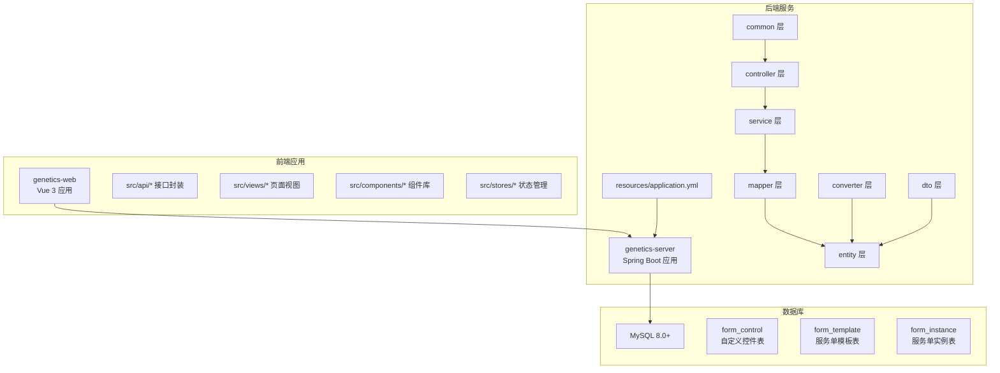
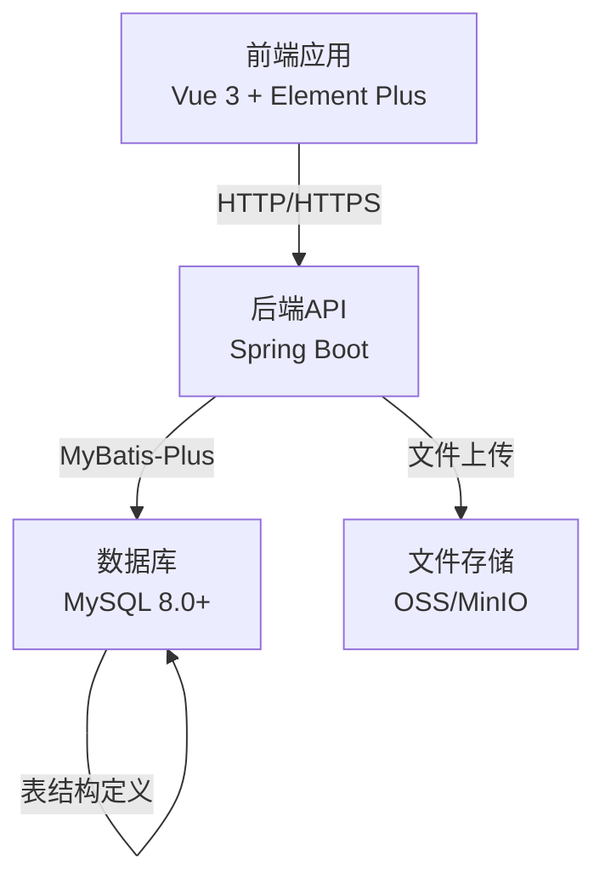
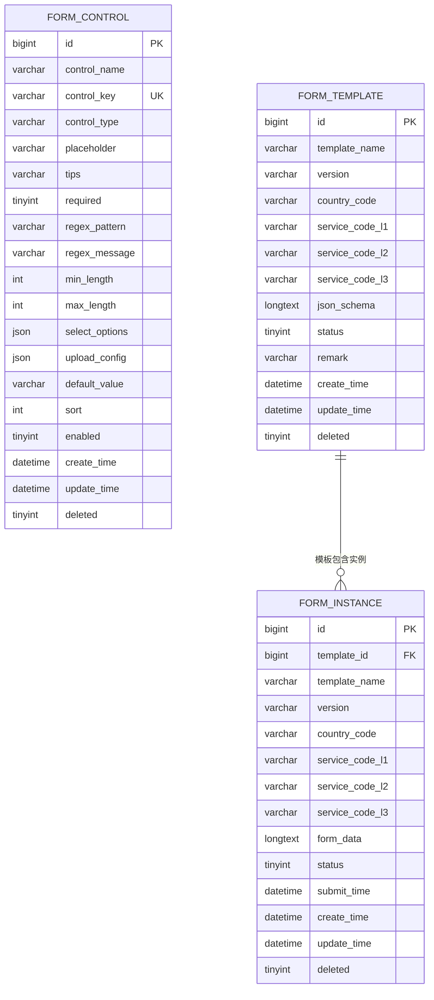
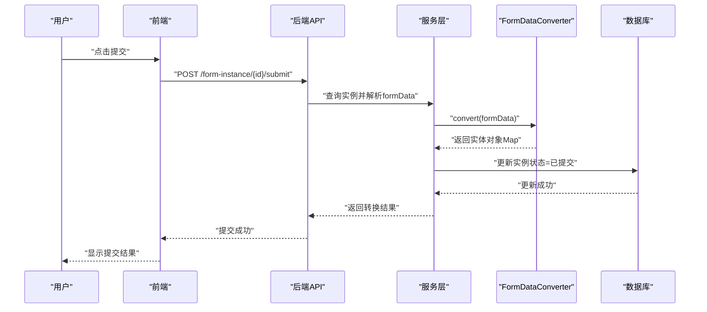
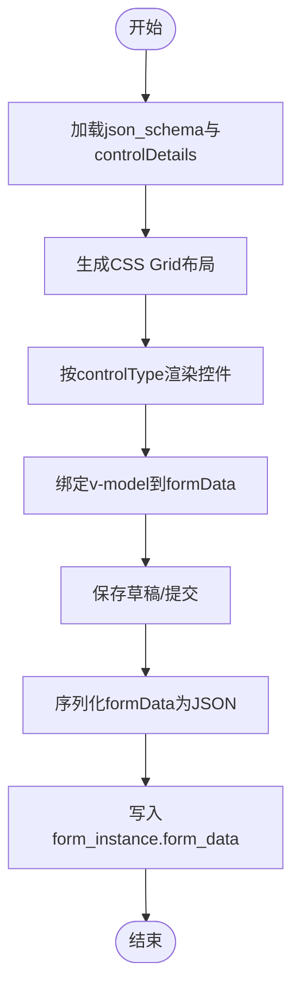
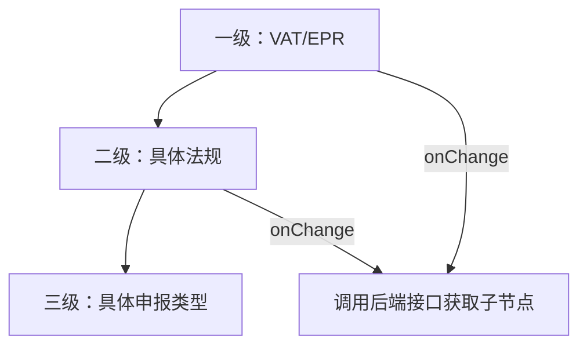
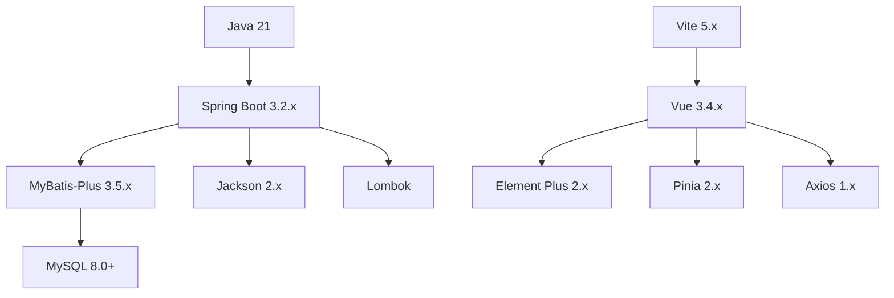

# 部署配置指南

<cite>
**本文档引用的文件**
- [VAT_EPR_动态表单技术方案.md](file://VAT_EPR_动态表单技术方案.md)
</cite>

## 目录
1. [简介](#简介)
2. [项目结构](#项目结构)
3. [核心组件](#核心组件)
4. [架构总览](#架构总览)
5. [详细组件分析](#详细组件分析)
6. [依赖关系分析](#依赖关系分析)
7. [性能考虑](#性能考虑)
8. [故障排除指南](#故障排除指南)
9. [结论](#结论)
10. [附录](#附录)

## 简介
本指南面向运维工程师与开发团队，提供VAT&EPR动态表单系统的完整部署配置方案。内容涵盖环境准备、数据库初始化、前后端构建与部署、容器化与Kubernetes编排、监控与日志管理、以及生产级安全与性能优化建议。系统采用Spring Boot + Vue 3 + Element Plus技术栈，支持动态表单设计器、多国家/多服务类型的模板化表单实例管理，并通过统一的JSON Schema驱动表单布局与渲染。

## 项目结构
根据技术方案文档，系统分为后端服务(genetics-server)与前端应用(genetics-web)，并包含数据库表结构与接口定义。后端采用分层结构：controller、service、mapper、entity、converter、dto、common等模块；前端采用组件化架构，包含动态表单渲染、表单设计器、状态管理与API封装。

图表来源
- [VAT_EPR_动态表单技术方案.md:773-852](file://VAT_EPR_动态表单技术方案.md#L773-L852)

章节来源
- [VAT_EPR_动态表单技术方案.md:773-852](file://VAT_EPR_动态表单技术方案.md#L773-L852)

## 核心组件
- 数据库层：包含自定义控件表、服务单模板表、服务单实例表，支持JSON Schema布局与动态表单数据存储。
- 服务端核心：
  - FormDataConverter：负责将Map<controlKey,value>转换为业务实体对象，支持按类名分组与反射赋值。
  - 控制器层：提供控件、模板、实例、服务类目的REST接口。
  - 服务层：封装业务逻辑，处理模板发布、实例创建、数据保存与提交。
  - 映射层：MyBatis-Plus Mapper实现数据库访问。
- 前端核心：
  - 动态表单渲染：基于JSON Schema生成网格布局，按控件类型渲染对应组件。
  - 表单设计器：左侧控件面板与右侧画板，支持拖拽布局与配置。
  - 状态管理：Pinia管理设计器与实例填写状态。

章节来源
- [VAT_EPR_动态表单技术方案.md:31-163](file://VAT_EPR_动态表单技术方案.md#L31-L163)
- [VAT_EPR_动态表单技术方案.md:592-728](file://VAT_EPR_动态表单技术方案.md#L592-L728)
- [VAT_EPR_动态表单技术方案.md:773-852](file://VAT_EPR_动态表单技术方案.md#L773-L852)

## 架构总览
系统采用前后端分离架构，前端通过Axios调用后端REST接口；后端基于Spring Boot提供统一API，使用MyBatis-Plus进行数据持久化；数据库采用MySQL 8.0+，支持JSON字段存储复杂结构。

图表来源
- [VAT_EPR_动态表单技术方案.md:10-28](file://VAT_EPR_动态表单技术方案.md#L10-L28)
- [VAT_EPR_动态表单技术方案.md:31-163](file://VAT_EPR_动态表单技术方案.md#L31-L163)

## 详细组件分析

### 数据库初始化与表结构
- form_control：定义可复用的表单控件，支持多种控件类型与校验规则，包含唯一键约束control_key。
- form_template：存储服务单模板，包含国家代码、服务类型三级编码、JSON Schema布局与状态。
- form_instance：存储服务单实例，包含模板冗余信息与表单数据JSON。

图表来源
- [VAT_EPR_动态表单技术方案.md:33-153](file://VAT_EPR_动态表单技术方案.md#L33-L153)

章节来源
- [VAT_EPR_动态表单技术方案.md:31-163](file://VAT_EPR_动态表单技术方案.md#L31-L163)

### 表单提交与对象转换流程
提交流程包括：解析formData JSON、调用FormDataConverter进行对象转换、打印转换结果日志、更新实例状态为“已提交”。

图表来源
- [VAT_EPR_动态表单技术方案.md:705-728](file://VAT_EPR_动态表单技术方案.md#L705-L728)
- [VAT_EPR_动态表单技术方案.md:592-684](file://VAT_EPR_动态表单技术方案.md#L592-L684)

章节来源
- [VAT_EPR_动态表单技术方案.md:460-478](file://VAT_EPR_动态表单技术方案.md#L460-L478)
- [VAT_EPR_动态表单技术方案.md:705-728](file://VAT_EPR_动态表单技术方案.md#L705-L728)

### 动态表单渲染与数据存储
- JSON Schema定义网格布局(columns/rows/cells)，每个cell包含controlId、controlKey、controlType与label。
- 前端根据controlType渲染对应组件(Input/Select/Switch/Upload/Textarea/Date/Number)，并维护formData对象。
- 后端将formData序列化为JSON存入form_instance.form_data字段，key命名规范为“ClassName.fieldName”。

图表来源
- [VAT_EPR_动态表单技术方案.md:482-589](file://VAT_EPR_动态表单技术方案.md#L482-L589)

章节来源
- [VAT_EPR_动态表单技术方案.md:531-577](file://VAT_EPR_动态表单技术方案.md#L531-L577)
- [VAT_EPR_动态表单技术方案.md:579-589](file://VAT_EPR_动态表单技术方案.md#L579-L589)

### 服务类目三级联动设计
- 一级：VAT服务(01) / EPR服务(02)
- 二级：VAT服务(0101) / 包装法(0201) / WEEE法(0202) / ...
- 三级：VAT新注册申报(010101) / VAT转代理申报(010102) / ...

图表来源
- [VAT_EPR_动态表单技术方案.md:732-769](file://VAT_EPR_动态表单技术方案.md#L732-L769)

章节来源
- [VAT_EPR_动态表单技术方案.md:732-769](file://VAT_EPR_动态表单技术方案.md#L732-L769)

## 依赖关系分析
- 技术栈依赖：后端使用Spring Boot 3.2.x、Java 21、MySQL 8.0+、MyBatis-Plus 3.5.x、Jackson 2.x、Lombok；前端使用Vue 3.4.x、Vite 5.x、Element Plus 2.x、Pinia 2.x、Axios 1.x。
- 组件耦合：控制器依赖服务层，服务层依赖映射层与转换器；前端组件依赖API封装与状态管理；转换器依赖实体类注册表。

图表来源
- [VAT_EPR_动态表单技术方案.md:9-28](file://VAT_EPR_动态表单技术方案.md#L9-L28)

章节来源
- [VAT_EPR_动态表单技术方案.md:9-28](file://VAT_EPR_动态表单技术方案.md#L9-L28)

## 性能考虑
- 数据库性能：为模板表添加索引以加速查询；对JSON字段进行合理拆分或缓存热点数据；使用连接池与慢查询日志监控。
- 应用性能：启用Spring Boot Actuator指标暴露；使用Redis缓存控件与模板元数据；对大文件上传采用分片与断点续传。
- 前端性能：按需加载组件与路由；压缩与懒加载静态资源；合理设置缓存策略。
- 并发控制：实例保存操作需加乐观锁(version字段)防止并发覆盖；提交后状态变为“已提交”禁止再次修改。

章节来源
- [VAT_EPR_动态表单技术方案.md:856-869](file://VAT_EPR_动态表单技术方案.md#L856-L869)

## 故障排除指南
- 控件唯一性校验失败：检查controlKey格式与唯一性约束，确保格式为“ClassName.fieldName”。
- 表单提交转换异常：确认FormDataConverter中的CLASS_REGISTRY已注册对应实体类；检查字段类型与值的兼容性。
- 文件上传失败：验证uploadConfig配置与文件存储服务可用性；检查文件大小与类型限制。
- 模板发布后不可修改：遵循版本管理策略，新建版本后再修改；避免影响已有实例数据。
- 日志与监控：开启后端日志输出与错误追踪；前端捕获网络异常并上报；使用APM工具监控接口耗时与错误率。

章节来源
- [VAT_EPR_动态表单技术方案.md:856-869](file://VAT_EPR_动态表单技术方案.md#L856-L869)

## 结论
本部署配置指南提供了从开发到生产的全生命周期实践路径。通过明确的环境要求、数据库初始化步骤、前后端构建与部署流程、容器化与Kubernetes编排建议，以及监控与故障排除策略，可确保VAT&EPR动态表单系统稳定、安全、高性能地运行于各类环境中。

## 附录
- 接口清单与示例：参考技术方案中的接口文档部分，包含控件、模板、实例与服务类目的REST API。
- 配置文件管理：后端application.yml用于数据库连接、日志级别、跨域与安全配置；前端通过环境变量区分开发/测试/生产环境。
- 安全配置要点：启用HTTPS、配置CORS白名单、限制文件上传类型与大小、对敏感字段进行脱敏处理、实施访问控制与审计日志。

章节来源
- [VAT_EPR_动态表单技术方案.md:167-396](file://VAT_EPR_动态表单技术方案.md#L167-L396)
- [VAT_EPR_动态表单技术方案.md:810-813](file://VAT_EPR_动态表单技术方案.md#L810-L813)