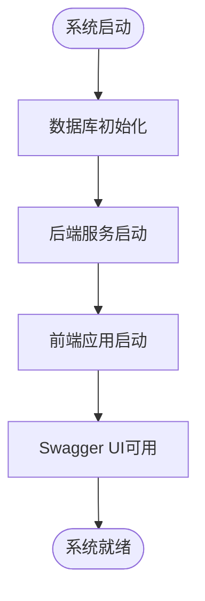
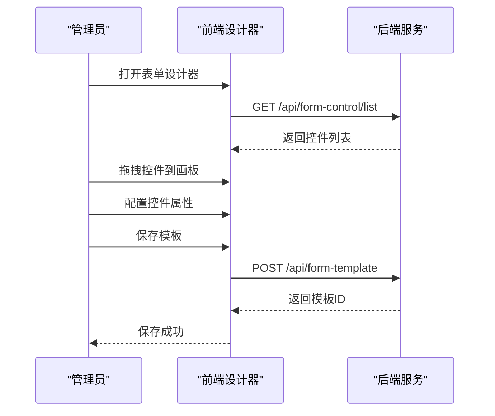

# 项目概述

<cite>
**本文档引用的文件**
- [README.md](file://README.md)
- [VAT_EPR_动态表单技术方案.md](file://VAT_EPR_动态表单技术方案.md)
- [genetics-server/src/main/java/com/genetics/GeneticsApplication.java](file://genetics-server/src/main/java/com/genetics/GeneticsApplication.java)
- [genetics-server/src/main/resources/application.yml](file://genetics-server/src/main/resources/application.yml)
- [genetics-server/src/main/resources/db/init.sql](file://genetics-server/src/main/resources/db/init.sql)
- [genetics-web/package.json](file://genetics-web/package.json)
- [genetics-web/vite.config.js](file://genetics-web/vite.config.js)
</cite>

## 更新摘要
**所做更改**
- 基于新增的README.md文档更新技术栈和项目结构说明
- 新增快速开始指南和核心功能详细介绍
- 更新API接口说明和业务状态流转
- 增强项目整体介绍和使用指导

## 目录
1. [简介](#简介)
2. [技术栈](#技术栈)
3. [项目结构](#项目结构)
4. [核心功能](#核心功能)
5. [快速开始](#快速开始)
6. [API接口](#api接口)
7. [数据库设计](#数据库设计)
8. [业务流程](#业务流程)
9. [总结](#总结)

## 简介
VAT & EPR 动态表单系统是一个基于 Spring Boot 3.2 + Vue 3 的企业级动态表单管理系统，专门针对增值税（VAT）与环境产品注册（EPR）服务的表单管理需求而设计。该系统通过"控件-模板-实例"的三层抽象架构，实现了高度灵活的表单设计与管理能力。

### 系统特色
- **动态表单设计**：支持可视化拖拽布局，灵活组合多种控件类型
- **多国家适配**：支持德国、法国、意大利、西班牙、波兰、捷克、英国等7个国家的法规差异
- **服务类目管理**：三级联动（VAT/EPR → 包装法/WEEE法 → 具体业务场景）精准匹配
- **全生命周期管理**：从模板设计到实例填写再到业务流转的完整闭环
- **前后端分离**：采用现代化技术栈，提供良好的开发体验

## 技术栈

### 后端技术栈
| 层次 | 技术 | 版本 | 用途 |
|------|------|------|------|
| 框架 | Spring Boot | 3.2 | 主框架 |
| 运行环境 | Java | 21 | 运行环境 |
| ORM | MyBatis-Plus | 3.5.5 | 数据持久化 |
| 数据库 | MySQL | 8.0+ | 关系型数据库 |
| 接口文档 | springdoc-openapi | 2.4 | Swagger UI |
| 核心特性 | Lombok | latest | 代码简化 |

### 前端技术栈
| 层次 | 技术 | 版本 | 用途 |
|------|------|------|------|
| 框架 | Vue | 3.4 | 主框架 |
| 构建工具 | Vite | 5 | 构建工具 |
| UI组件库 | Element Plus | 2.6 | 组件库 |
| 状态管理 | Pinia | 2.1 | 状态管理 |
| 拖拽 | vuedraggable | 4.1 | 拖拽排序 |
| HTTP客户端 | Axios | 1.6 | 网络请求 |

**章节来源**
- [README.md:5-17](file://README.md#L5-L17)
- [VAT_EPR_动态表单技术方案.md:7-28](file://VAT_EPR_动态表单技术方案.md#L7-L28)

## 项目结构
项目采用前后端分离的微服务架构，整体目录结构清晰明确：

```
genetics/
├── genetics-server/          # 后端 Spring Boot 工程
│   ├── src/main/java/com/genetics/
│   │   ├── config/           # 配置（MyBatis-Plus、Swagger、CORS）
│   │   ├── controller/       # REST 接口层
│   │   ├── converter/        # FormDataConverter（表单数据 → 实体）
│   │   ├── dto/              # 请求/响应 DTO & VO
│   │   ├── entity/           # 数据库实体
│   │   ├── enums/            # 枚举（控件类型、国家代码、业务状态）
│   │   ├── mapper/           # MyBatis-Plus Mapper
│   │   └── service/          # 业务逻辑层
│   └── src/main/resources/
│       ├── application.yml   # 配置文件
│       └── db/init.sql       # 数据库初始化脚本
└── genetics-web/             # 前端 Vue 3 工程
    └── src/
        ├── api/              # Axios 接口封装
        ├── components/
        │   ├── DynamicForm/  # 动态表单渲染引擎
        │   └── FormDesigner/ # 拖拽式表单设计器
        ├── stores/           # Pinia 状态管理
        └── views/            # 页面
            ├── control/      # 控件管理
            ├── template/     # 模板管理 & 设计器
            └── instance/     # 服务单列表 & 填写
```

**章节来源**
- [README.md:18-46](file://README.md#L18-L46)
- [VAT_EPR_动态表单技术方案.md:773-803](file://VAT_EPR_动态表单技术方案.md#L773-L803)

## 核心功能

### 自定义控件
系统支持7种基础控件类型，每种控件都具备完整的配置能力：

**支持的控件类型：**
- `INPUT` - 文本输入框
- `TEXTAREA` - 多行文本域  
- `NUMBER` - 数字输入框
- `SELECT` - 下拉选择框
- `SWITCH` - 开关控件
- `DATE` - 日期选择器
- `UPLOAD` - 文件上传控件

**控件配置规范：**
- **controlKey**：格式为 `ClassName.fieldName`（如 `Company.companyName`）
- **校验规则**：必填、最小/最大长度、正则表达式
- **高级配置**：下拉选项、上传配置、说明提示

### 服务单模板（表单设计器）
- 左侧控件面板 + 右侧网格画板的拖拽式设计界面
- 支持1-4列布局，每个控件可调整跨列宽度
- 三级联动服务类型：VAT / EPR → 包装法/WEEE法 → 具体业务场景
- 国家代码支持：DEU / FRA / ITA / ESP / POL / CZE / GBR
- JSON Schema存储，支持版本管理和发布/草稿状态

### 服务单实例
- 基于已发布模板创建服务单实例
- 动态表单渲染并支持实时草稿保存
- 完整的业务状态流转管理

**业务状态流转：**
| statusId | 名称 |
|----------|------|
| 10 | 待提交 |
| 20 | 待审核 |
| 30 | 待递交 |
| 31 | 组织处理 |
| 32 | 税局处理 |
| 33 | 当地同事处理 |
| 40 | 已完成 |
| 50 | 已驳回 |
| 99 | 已终止 |

### FormDataConverter（核心转换器）
提交时的核心转换逻辑，将表单数据按controlKey中的类名分组并通过反射创建对应实体：

```json
{
  "Company.companyName": "测试公司", 
  "CompanyLegalPerson.companyLegalName": "张三"
}
       ↓
{ 
  Company: {companyName: "测试公司"}, 
  CompanyLegalPerson: {companyLegalName: "张三"} 
}
```

**章节来源**
- [README.md:90-137](file://README.md#L90-L137)
- [VAT_EPR_动态表单技术方案.md:594-703](file://VAT_EPR_动态表单技术方案.md#L594-L703)

## 快速开始

### 1. 初始化数据库
在 MySQL 中执行初始化脚本：

```bash
mysql -u root -p < genetics-server/src/main/resources/db/init.sql
```

### 2. 配置数据库连接
修改 `genetics-server/src/main/resources/application.yml`：

```yaml
spring:
  datasource:
    url: jdbc:mysql://localhost:3306/genetics_db?useUnicode=true&characterEncoding=utf8&useSSL=false&serverTimezone=Asia/Shanghai
    username: root
    password: 你的密码
```

### 3. 启动后端服务
```bash
cd genetics-server
mvn spring-boot:run
```

后端启动后访问：http://localhost:8080/swagger-ui.html

### 4. 启动前端应用
```bash
cd genetics-web
npm install
npm run dev
```

前端启动后访问：http://localhost:5173

**章节来源**
- [README.md:48-88](file://README.md#L48-L88)

## API接口

### 接口前缀
| 模块 | 接口前缀 |
|------|---------|
| 自定义控件 | `GET/POST/PUT/DELETE /api/form-control` |
| 服务单模板 | `GET/POST/PUT /api/form-template` |
| 服务单实例 | `GET/POST/PUT /api/form-instance` |
| 基础数据 | `GET /api/basic` |

### 完整接口文档
系统集成了springdoc-openapi，完整的接口文档可通过以下地址访问：
http://localhost:8080/swagger-ui.html

**章节来源**
- [README.md:138-147](file://README.md#L138-L147)
- [VAT_EPR_动态表单技术方案.md:167-396](file://VAT_EPR_动态表单技术方案.md#L167-L396)

## 数据库设计

### 自定义控件表 `form_control`
```sql
CREATE TABLE `form_control` (
    `id` BIGINT NOT NULL AUTO_INCREMENT COMMENT '主键ID',
    `control_name` VARCHAR(100) NOT NULL COMMENT '控件名称（展示用）',
    `control_key` VARCHAR(200) NOT NULL COMMENT '控件key，格式: ClassName.fieldName',
    `control_type` VARCHAR(30) NOT NULL COMMENT '控件类型: INPUT/SELECT/SWITCH/UPLOAD/TEXTAREA/DATE/NUMBER',
    `placeholder` VARCHAR(200) DEFAULT NULL COMMENT '占位文本',
    `tips` VARCHAR(500) DEFAULT NULL COMMENT '控件说明(TIPS)',
    `required` TINYINT(1) NOT NULL DEFAULT 0 COMMENT '是否必填: 0否 1是',
    `regex_pattern` VARCHAR(500) DEFAULT NULL COMMENT '正则表达式约束',
    `regex_message` VARCHAR(200) DEFAULT NULL COMMENT '正则校验失败提示语',
    `min_length` INT DEFAULT NULL COMMENT '最小长度',
    `max_length` INT DEFAULT NULL COMMENT '最大长度',
    `select_options` JSON DEFAULT NULL COMMENT '下拉框选项',
    `upload_config` JSON DEFAULT NULL COMMENT '上传文件配置',
    `default_value` VARCHAR(500) DEFAULT NULL COMMENT '默认值',
    `sort` INT NOT NULL DEFAULT 0 COMMENT '排序',
    `enabled` TINYINT(1) NOT NULL DEFAULT 1 COMMENT '是否启用',
    `create_time` DATETIME NOT NULL DEFAULT CURRENT_TIMESTAMP,
    `update_time` DATETIME NOT NULL DEFAULT CURRENT_TIMESTAMP ON UPDATE CURRENT_TIMESTAMP,
    `deleted` TINYINT(1) NOT NULL DEFAULT 0,
    PRIMARY KEY (`id`),
    UNIQUE KEY `uk_control_key` (`control_key`)
) ENGINE=InnoDB DEFAULT CHARSET=utf8mb4 COMMENT='自定义控件定义表';
```

### 服务单模板表 `form_template`
```sql
CREATE TABLE `form_template` (
    `id` BIGINT NOT NULL AUTO_INCREMENT COMMENT '主键ID（自增）',
    `template_name` VARCHAR(100) NOT NULL COMMENT '服务单名称',
    `version` VARCHAR(20) NOT NULL DEFAULT '1.0.0' COMMENT '服务单版本',
    `country_code` VARCHAR(10) NOT NULL COMMENT '关联国家代码，三位: DEU/FRA/ITA/ESP/POL/CZE/GBR',
    `service_code_l1` VARCHAR(10) NOT NULL COMMENT '服务类型一级code',
    `service_code_l2` VARCHAR(10) NOT NULL COMMENT '服务类型二级code',
    `service_code_l3` VARCHAR(10) NOT NULL COMMENT '服务类型三级code',
    `json_schema` LONGTEXT NOT NULL COMMENT '画板定义的JSON Schema',
    `status` TINYINT(1) NOT NULL DEFAULT 0 COMMENT '状态: 0草稿 1发布',
    `remark` VARCHAR(500) DEFAULT NULL COMMENT '备注',
    `create_time` DATETIME NOT NULL DEFAULT CURRENT_TIMESTAMP,
    `update_time` DATETIME NOT NULL DEFAULT CURRENT_TIMESTAMP ON UPDATE CURRENT_TIMESTAMP,
    `deleted` TINYINT(1) NOT NULL DEFAULT 0,
    PRIMARY KEY (`id`)
) ENGINE=InnoDB DEFAULT CHARSET=utf8mb4 COMMENT='服务单模板表';
```

### 服务单实例表 `form_instance`
```sql
CREATE TABLE `form_instance` (
    `id` BIGINT NOT NULL AUTO_INCREMENT COMMENT '主键ID',
    `template_id` BIGINT NOT NULL COMMENT '关联的服务单模板ID',
    `template_name` VARCHAR(100) NOT NULL COMMENT '服务单名称（冗余）',
    `version` VARCHAR(20) NOT NULL COMMENT '服务单版本（冗余）',
    `country_code` VARCHAR(10) NOT NULL COMMENT '国家代码（冗余）',
    `service_code_l1` VARCHAR(10) NOT NULL COMMENT '一级服务类型code',
    `service_code_l2` VARCHAR(10) NOT NULL COMMENT '二级服务类型code',
    `service_code_l3` VARCHAR(10) NOT NULL COMMENT '三级服务类型code',
    `form_data` LONGTEXT NOT NULL COMMENT '表单数据，存储Map<controlKey, value>，JSON格式',
    `status` TINYINT(1) NOT NULL DEFAULT 0 COMMENT '状态: 0草稿 1已提交 2已审核',
    `submit_time` DATETIME DEFAULT NULL COMMENT '提交时间',
    `create_time` DATETIME NOT NULL DEFAULT CURRENT_TIMESTAMP,
    `update_time` DATETIME NOT NULL DEFAULT CURRENT_TIMESTAMP ON UPDATE CURRENT_TIMESTAMP,
    `deleted` TINYINT(1) NOT NULL DEFAULT 0,
    PRIMARY KEY (`id`),
    KEY `idx_template_id` (`template_id`)
) ENGINE=InnoDB DEFAULT CHARSET=utf8mb4 COMMENT='服务单实例表';
```

**章节来源**
- [VAT_EPR_动态表单技术方案.md:31-163](file://VAT_EPR_动态表单技术方案.md#L31-L163)
- [genetics-server/src/main/resources/db/init.sql:8-72](file://genetics-server/src/main/resources/db/init.sql#L8-L72)

## 业务流程

### 系统启动流程


### 表单设计流程


### 服务单填写流程


**章节来源**
- [README.md:48-88](file://README.md#L48-L88)
- [VAT_EPR_动态表单技术方案.md:399-478](file://VAT_EPR_动态表单技术方案.md#L399-L478)

## 总结

VAT & EPR 动态表单系统通过现代化的技术架构和清晰的功能设计，为企业提供了高效、灵活的表单管理解决方案。系统的主要优势包括：

### 技术优势
- **前后端分离架构**：采用Spring Boot + Vue 3的现代化技术栈
- **高度可扩展性**：模块化设计支持功能扩展和定制开发
- **完善的开发工具链**：集成Swagger UI、Vite构建工具等开发辅助工具

### 业务价值
- **降低开发成本**：通过模板化设计减少重复开发工作
- **提升用户体验**：直观的拖拽式设计界面和动态表单渲染
- **增强合规能力**：多国家适配和三级联动确保符合不同地区法规要求
- **提高运营效率**：完整的业务状态流转和数据转换机制

### 适用场景
- 增值税（VAT）申报表单管理
- 环境产品注册（EPR）相关表单处理
- 跨国企业的合规表单统一管理
- 需要灵活表单设计的各类业务场景

该系统为VAT和EPR服务提供了强有力的技术支撑，通过标准化的数据模型和灵活的业务流程，能够有效提升企业的表单管理效率和合规水平。