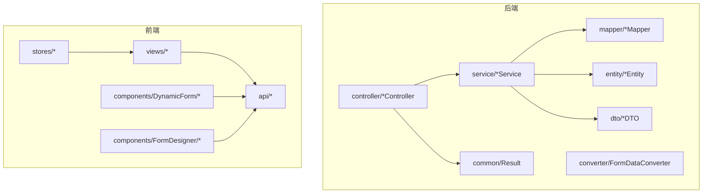
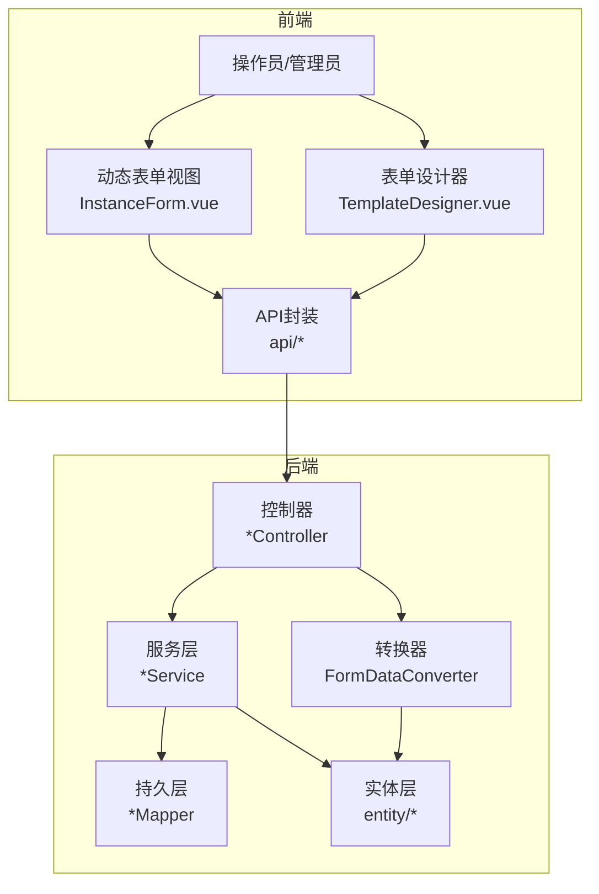
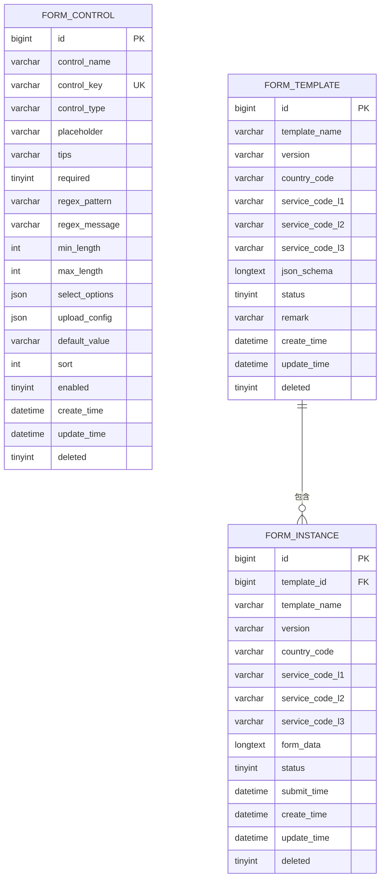
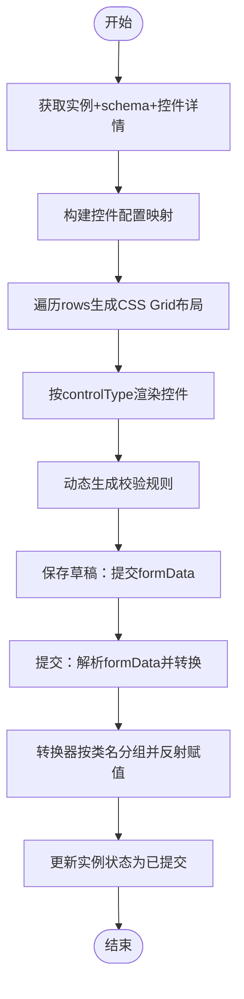
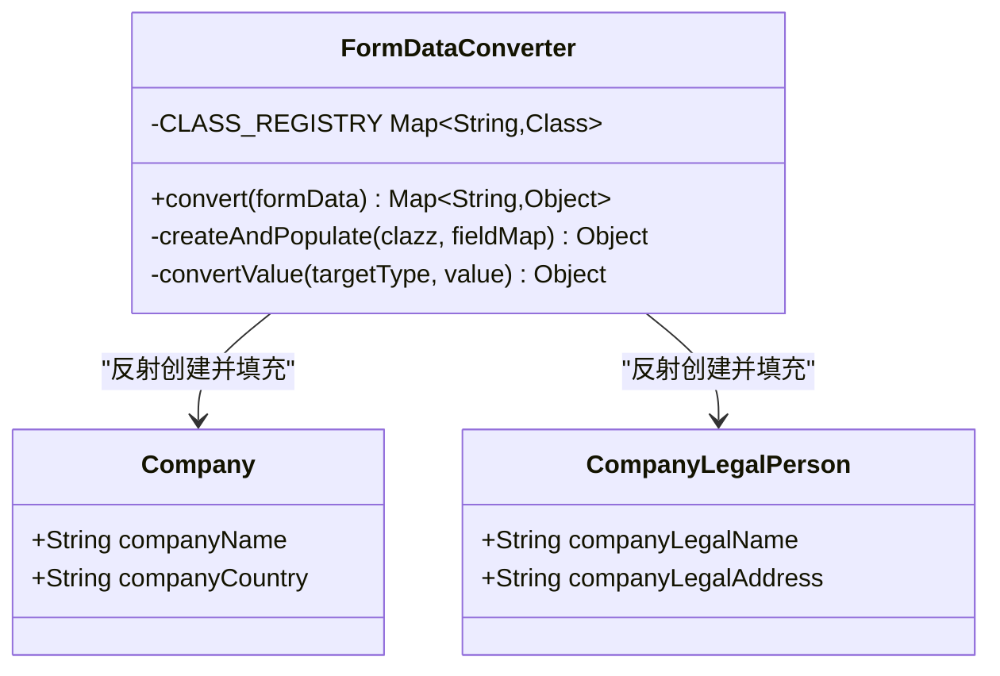
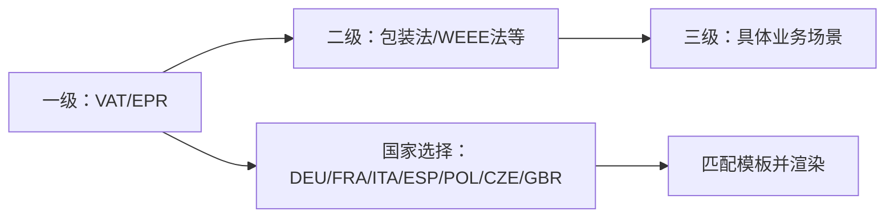
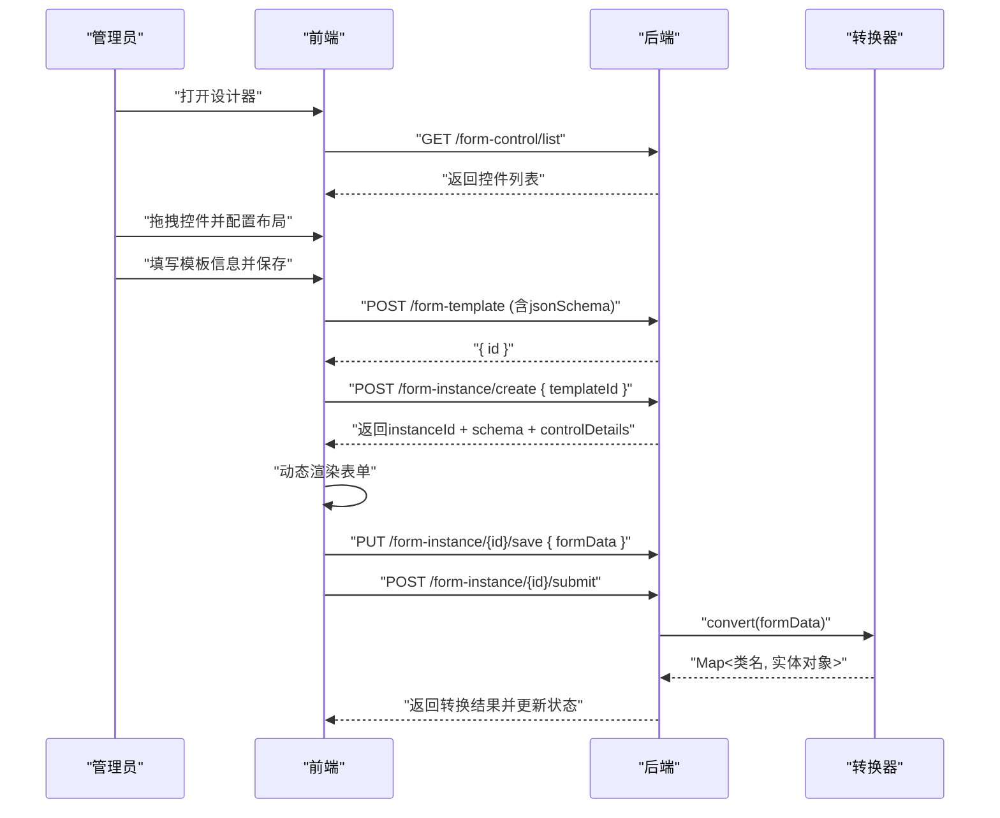
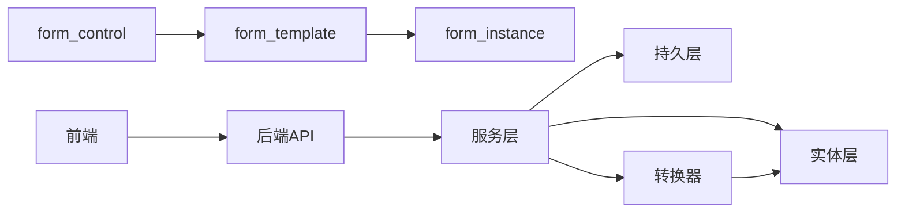

# 项目概述

<cite>
**本文档引用的文件**
- [VAT_EPR_动态表单技术方案.md](file://VAT_EPR_动态表单技术方案.md)
</cite>

## 目录
1. [简介](#简介)
2. [项目结构](#项目结构)
3. [核心组件](#核心组件)
4. [架构总览](#架构总览)
5. [详细组件分析](#详细组件分析)
6. [依赖关系分析](#依赖关系分析)
7. [性能考量](#性能考量)
8. [故障排查指南](#故障排查指南)
9. [结论](#结论)
10. [附录](#附录)

## 简介
本项目面向增值税（VAT）与环境产品注册（EPR）服务的表单管理需求，提供一套“动态表单系统”。其核心目标是通过“控件-模板-实例”的三层抽象，实现：
- 动态表单设计：可视化拖拽布局，灵活组合多种控件类型（输入、选择、开关、上传、日期、数字、文本域等）
- 多国家适配：以国家代码为维度，支持多国家（德国、法国、意大利、西班牙、波兰、捷克、英国）的法规差异
- 服务类目管理：三级联动（一级：VAT/EPR；二级：包装法/WEEE法等；三级：具体业务场景）支撑精准匹配
- 数据模型转换：将用户填写的动态表单数据按“类名.字段名”映射到业务实体对象，便于后续业务处理

该系统通过前后端分离架构，结合服务端的表单数据转换器与前端的动态渲染引擎，形成从“模板设计—实例填写—数据转换—业务流转”的闭环，显著提升表单管理的灵活性与可维护性。

## 项目结构
后端采用Spring Boot + MyBatis-Plus，前端采用Vue 3 + Element Plus + Vite，整体目录建议如下：
- 后端模块
  - controller：对外HTTP接口层（控件、模板、实例、服务类目）
  - service：业务逻辑层（控件、模板、实例服务）
  - mapper：MyBatis映射层
  - entity：持久化实体与业务实体
  - converter：表单数据转换器
  - dto：接口传输对象
  - common：通用返回封装
- 前端模块
  - api：各模块HTTP客户端封装
  - views：页面级视图（控件管理、模板列表/设计器、实例列表/表单）
  - components：可复用组件（动态表单、控件渲染器、表单设计器）
  - stores：Pinia状态管理

**章节来源**
- [VAT_EPR_动态表单技术方案.md:773-852](file://VAT_EPR_动态表单技术方案.md#L773-L852)

## 核心组件
- 自定义控件（FormControl）
  - 定义控件元数据（类型、占位、提示、必填、正则、长度、下拉选项、上传配置、默认值、排序、启用状态）
  - 控件键命名规范：类名.字段名（如 Company.companyName），用于与业务实体映射
- 服务单模板（FormTemplate）
  - 以JSON Schema描述布局（网格布局、行列、跨列、控件引用）
  - 关联国家代码与服务类目（L1/L2/L3），支持草稿/发布状态
- 服务单实例（FormInstance）
  - 基于模板创建，存储表单数据（Map<controlKey, value>序列化为JSON）
  - 支持草稿、已提交、已审核状态流转
- 表单数据转换器（FormDataConverter）
  - 将Map<controlKey, value>按类名分组，反射构造业务实体对象，输出Map<类名, 实体对象>
- 服务类目API
  - 透传现有系统的一级/二级/三级类目树，供前端三级联动选择

**章节来源**
- [VAT_EPR_动态表单技术方案.md:33-163](file://VAT_EPR_动态表单技术方案.md#L33-L163)
- [VAT_EPR_动态表单技术方案.md:594-728](file://VAT_EPR_动态表单技术方案.md#L594-L728)
- [VAT_EPR_动态表单技术方案.md:389-395](file://VAT_EPR_动态表单技术方案.md#L389-L395)

## 架构总览
系统采用前后端分离架构，核心交互链路如下：
- 管理员在前端设计器中拖拽控件、配置布局，保存模板
- 操作员在前端选择模板，动态渲染表单并填写数据，保存草稿或提交
- 提交流程触发后端转换器，将表单数据映射为业务实体对象，更新实例状态并触发后续业务

**图表来源**
- [VAT_EPR_动态表单技术方案.md:773-852](file://VAT_EPR_动态表单技术方案.md#L773-L852)
- [VAT_EPR_动态表单技术方案.md:594-728](file://VAT_EPR_动态表单技术方案.md#L594-L728)

## 详细组件分析

### 数据模型与存储
- 控件表（form_control）
  - 字段涵盖控件名称、键、类型、占位、提示、必填、正则、长度、下拉选项、上传配置、默认值、排序、启用状态
  - control_key唯一约束，确保键的全局唯一
- 模板表（form_template）
  - json_schema描述布局，包含网格列数、行数组、每个单元格的控件引用（controlId、controlKey、controlType、label、跨列）
  - 关联国家代码与服务类目（L1/L2/L3），草稿/发布状态
- 实例表（form_instance）
  - form_data以JSON存储Map<controlKey, value>，冗余存储模板信息（模板名、版本、国家代码、服务类目）

**图表来源**
- [VAT_EPR_动态表单技术方案.md:33-163](file://VAT_EPR_动态表单技术方案.md#L33-L163)

**章节来源**
- [VAT_EPR_动态表单技术方案.md:33-163](file://VAT_EPR_动态表单技术方案.md#L33-L163)

### 动态表单渲染与数据存储
- JSON Schema布局
  - layout/grid/columns/rows/cells：定义网格布局与控件引用
  - 每个cell包含controlId、controlKey、controlType、label、colSpan等
- 前端渲染流程
  - 获取实例+schema+控件详情，构建控件配置映射
  - 遍历rows生成CSS Grid布局，按controlType渲染对应组件（输入、选择、开关、上传、日期、数字、文本域）
  - 校验规则来自控件详情（正则、必填、长度等）
  - 用户输入维护formData对象，保存时原样传回后端
- 数据存储策略
  - form_data存储Map<controlKey, value>，key命名规范与controlKey一致
  - value类型支持字符串、布尔、数值、文件列表、日期字符串

**图表来源**
- [VAT_EPR_动态表单技术方案.md:482-590](file://VAT_EPR_动态表单技术方案.md#L482-L590)

**章节来源**
- [VAT_EPR_动态表单技术方案.md:482-590](file://VAT_EPR_动态表单技术方案.md#L482-L590)

### 表单数据转换器（核心）
- 转换流程
  - 输入：Map<"类名.字段名", 值>
  - 分组：按类名分组，得到Map<类名, Map<字段名, 值>>
  - 反射：根据类名查找注册实体，无参构造实例，反射设置字段值（含类型转换）
  - 输出：Map<类名, 实体对象>
- 关键点
  - 类注册：当前通过静态注册表维护，后续可扩展为注解扫描
  - 错误处理：字段不存在、类型不匹配、反射异常均记录日志并抛出运行时异常
  - 日志：打印转换结果，便于调试与审计

**图表来源**
- [VAT_EPR_动态表单技术方案.md:594-703](file://VAT_EPR_动态表单技术方案.md#L594-L703)

**章节来源**
- [VAT_EPR_动态表单技术方案.md:594-703](file://VAT_EPR_动态表单技术方案.md#L594-L703)

### 服务类目与多国家适配
- 服务类目三级联动
  - 一级：VAT（01）/ EPR（02）
  - 二级：包装法（0201）、WEEE法（0202）等（透传既有系统）
  - 三级：具体业务场景（如VAT新注册申报）
- 多国家适配
  - 模板绑定国家代码（如DEU/FRA/ITA/ESP/POL/CZE/GBR）
  - 前端三级联动选择国家+服务类目，后端据此筛选可用模板

**图表来源**
- [VAT_EPR_动态表单技术方案.md:732-770](file://VAT_EPR_动态表单技术方案.md#L732-L770)

**章节来源**
- [VAT_EPR_动态表单技术方案.md:732-770](file://VAT_EPR_动态表单技术方案.md#L732-L770)

### 接口与时序逻辑
- 自定义控件管理时序
  - 管理员填写控件信息，后端校验controlKey格式与唯一性，保存后返回ID
- 服务单模板设计时序
  - 前端设计器获取控件列表，拖拽配置布局，保存模板（含jsonSchema）
- 创建并填写服务单时序
  - 选择模板创建实例，后端返回schema与控件详情，前端动态渲染；保存草稿或提交
- 服务单提交与对象转换时序
  - 提交后解析formData，调用转换器按类名分组并反射赋值，更新状态并返回转换结果

**图表来源**
- [VAT_EPR_动态表单技术方案.md:401-478](file://VAT_EPR_动态表单技术方案.md#L401-L478)

**章节来源**
- [VAT_EPR_动态表单技术方案.md:401-478](file://VAT_EPR_动态表单技术方案.md#L401-L478)

## 依赖关系分析
- 控件与模板
  - 模板通过json_schema引用控件（controlId、controlKey），控件唯一键保证一致性
- 模板与实例
  - 实例基于模板创建，冗余存储模板信息，保证模板发布后实例不受影响
- 前端与后端
  - 前端通过API获取控件列表、模板详情、实例数据；后端负责数据校验、转换与持久化
- 转换器与实体
  - 转换器依赖实体类注册表，按类名反射构造对象

**图表来源**
- [VAT_EPR_动态表单技术方案.md:33-163](file://VAT_EPR_动态表单技术方案.md#L33-L163)
- [VAT_EPR_动态表单技术方案.md:773-852](file://VAT_EPR_动态表单技术方案.md#L773-L852)

**章节来源**
- [VAT_EPR_动态表单技术方案.md:33-163](file://VAT_EPR_动态表单技术方案.md#L33-L163)
- [VAT_EPR_动态表单技术方案.md:773-852](file://VAT_EPR_动态表单技术方案.md#L773-L852)

## 性能考量
- 前端渲染
  - 使用CSS Grid布局，减少DOM层级；控件渲染按类型分发，避免复杂计算
  - 校验规则动态生成，建议缓存控件配置映射，降低重复计算
- 后端处理
  - 转换器按类名分组与反射赋值，建议对常用类名进行预热注册，减少反射开销
  - JSON序列化/反序列化建议使用流式处理，避免大对象内存峰值
- 数据库
  - 控件键唯一索引保障查询效率；模板与实例建立必要索引（模板ID、国家代码、服务类目）
- 并发控制
  - 实例保存建议引入乐观锁（version字段）防止并发覆盖

[本节为通用指导，无需特定文件引用]

## 故障排查指南
- 控件键冲突
  - 现象：保存控件时报唯一约束错误
  - 处理：检查control_key是否符合“类名.字段名”，确保全局唯一
- 控件键格式错误
  - 现象：提交时提示格式无效
  - 处理：确认control_key包含且仅包含一个点号
- 实体未注册
  - 现象：转换阶段找不到类，日志警告
  - 处理：在转换器注册表中添加对应类，或扩展为注解扫描
- 文件上传
  - 现象：上传控件提交后value为URL列表
  - 处理：确保文件服务（如OSS/MinIO）可用，上传成功后再提交
- 实例状态
  - 现象：提交后无法再次修改
  - 处理：提交后状态变为已提交，需重新创建实例或走变更流程

**章节来源**
- [VAT_EPR_动态表单技术方案.md:856-869](file://VAT_EPR_动态表单技术方案.md#L856-L869)

## 结论
本项目通过“控件-模板-实例”的动态表单体系，结合服务类目与多国家适配，提供了高灵活性、强扩展性的表单管理解决方案。其核心价值体现在：
- 降低表单变更成本：模板发布后可独立演进，实例不受影响
- 提升开发效率：前端可视化设计、后端统一转换器，减少重复开发
- 强化合规能力：多国家与三级类目联动，满足不同地区法规要求
- 明确的技术路径：前后端分离、清晰的职责边界、可扩展的注册机制

对于初学者，建议先从控件与模板的基本概念入手，理解controlKey命名规范与json_schema布局；对于有经验的开发者，可关注转换器的扩展点、并发控制与性能优化策略。

[本节为总结性内容，无需特定文件引用]

## 附录
- 技术栈
  - 后端：Spring Boot 3.2.x、Java 21、MySQL 8.0+、MyBatis-Plus 3.5.x、Jackson 2.x、Lombok
  - 前端：Vue 3.4.x、Vite 5.x、Element Plus 2.x、Vue Draggable next、Pinia 2.x、Axios 1.x
- 关键约束与注意事项
  - control_key唯一性与格式校验
  - 模板发布后禁止修改json_schema
  - 实体类注册与转换器扩展
  - 文件上传与数据安全
  - 并发控制与状态机

**章节来源**
- [VAT_EPR_动态表单技术方案.md:7-28](file://VAT_EPR_动态表单技术方案.md#L7-L28)
- [VAT_EPR_动态表单技术方案.md:856-869](file://VAT_EPR_动态表单技术方案.md#L856-L869)